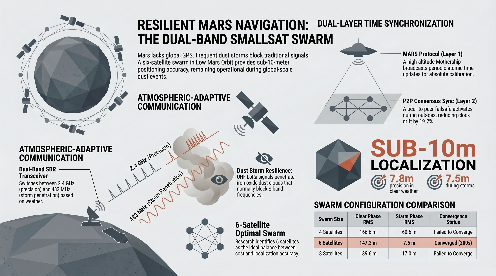
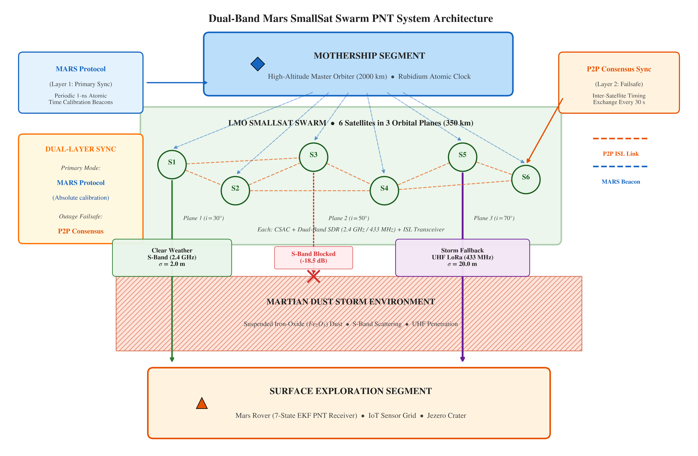
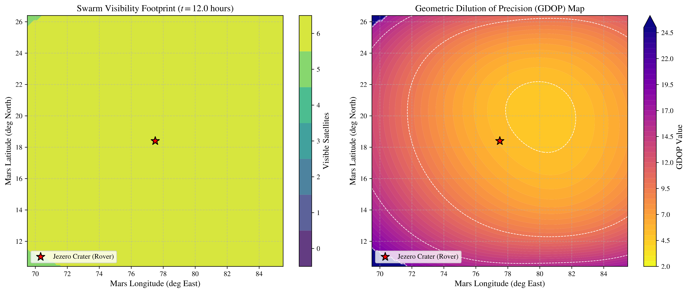
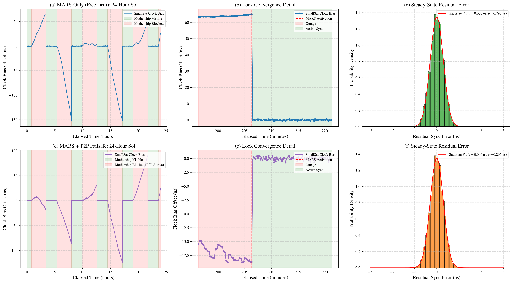

# Dual-Band Hybrid LoRa-based SmallSat Swarm PNT System for Mars Exploration

<p align="center">
  
</p>

This repository contains the high-fidelity Python simulation environment for the **Dual-Band Hybrid LoRa-based SmallSat Swarm PNT System for Mars Exploration**.

The project designs and evaluates a localized Positioning, Navigation, and Timing (PNT) system for Mars surface assets (rovers and IoT sensor grids) utilizing a Low Mars Orbit (LMO) SmallSat swarm, a high-altitude master Mothership, and an atmospheric-adaptive dual-band communications payload.

---

## 🌌 System Concept & Key Architecture

<p align="center">
  
</p>

The architecture addresses three critical challenges of Martian exploration:
1. **Severe Weather Attenuation**: High-frequency bands (S-band/X-band) suffer heavy scattering and absorption during global dust storms. Our system dynamically falls back to **UHF (433 MHz) LoRa Chirp Spread Spectrum (CSS)** to penetrate suspended iron-oxide dust.
2. **Strict SWaP-C Constraints**: Standard GNSS systems require heavy, power-hungry atomic clocks. Our swarm SmallSats utilize low-power Chip-Scale Atomic Clocks (CSAC) synchronized to a master Mothership using the **Mothership Asymmetric Relational Sync (MARS)** protocol. During inevitable occultation outages, the system activates a **Peer-to-Peer (P2P) Consensus Sync failsafe** to mathematically bound inter-satellite clock drift by over 19%.
3. **Propulsion and Launch Constraints**: Placing satellites in low-altitude Low Mars Orbit (LMO) utilizes atmospheric aerobraking for orbit insertion, saving a massive amount of propellant compared to Areostationary orbits.

---

## 📁 Repository Structure

```
Mars-SmallSat-Swarm-PNT-System/
├── README.md                 # Project documentation (this file)
└── simulation/               # Modular Python simulation engine
    ├── parameters.py         # Physics, orbital, and filter noise parameters
    ├── simulator.py          # Core EKF filter and orbital propagator
    ├── run_simulation.py     # Main runner script executing comparisons and plotting
    ├── extended_analysis.py  # Script for spatial GDOP and clock sensitivity sweeps
    ├── generate_diagram.py   # Script to render the conceptual system block diagram
    ├── orbit_3d.pdf          # High-resolution 3D constellation orbit map
    ├── gdop_visibility.pdf   # GDOP and visibility times series
    ├── positioning_error.pdf # EKF tracking error time series
    ├── performance_comparison.pdf # Swarm metrics comparison bar charts
    ├── gdop_heatmap.pdf      # 2D spatial GDOP map
    ├── clock_sensitivity.pdf # Clock sensitivity plot
    ├── mars_sync_simulation.pdf # MARS protocol sync timeline
    ├── power_budget_simulation.pdf # Power and battery SoC timeline
    └── data/                 # Folder containing generated .npz simulation data
```

---

## 🛠️ Installation & Requirements

Ensure you have a Python 3 environment and a LaTeX compiler installed.

### Python Dependencies
Install the required packages using pip:
```bash
pip install numpy matplotlib scipy
```


---

## 🚀 How to Run

### 1. Run the Navigation Simulation
Execute the comparative study to run the Extended Kalman Filter (EKF) across all four swarm configurations:
```bash
cd simulation
python3 run_simulation.py
```
This script will:
* Run EKF simulations for 4, 6, and 8-satellite dual-band configurations as well as a 6-satellite S-band only configuration.
* Save the numerical trajectory and estimation data to `simulation/data/`.
* Write the statistical summary to `simulation/data/metrics_summary.txt`.
* Generate and export high-resolution vector PDF figures representing trajectory, GDOP, positioning error, and performance metrics.

### 2. Run the Extended Analysis (Optional)
Execute the advanced spatial GDOP contour and clock drift sensitivity sweeps:
```bash
cd simulation
python3 extended_analysis.py
```
This script will:
* Sweep a 2D spatial grid around Jezero Crater to compute visible satellites and GDOP at the alignment peak.
* Sweep the rover's clock stability across 9 orders of magnitude to calculate the positioning error drift during the 23.82-hour orbital outage.
* Run a dynamic 24-hour simulation of the MARS clock synchronization protocol between an LMO satellite and the Mothership to evaluate sync convergence and residual errors.
* Run a 24-hour power simulation modeling solar panels (including eclipses) and payload/bus power to evaluate battery State of Charge (SoC).
* Generate and export advanced analytical vector figures (`gdop_heatmap.pdf`, `clock_sensitivity.pdf`, `mars_sync_simulation.pdf`, and `power_budget_simulation.pdf`).


---

## 📊 Summary of Simulation Configurations

The simulation propagations assess four configurations over a $24$-hour operational cycle:

| Configuration | Band Selection | Storm Mitigation | Expected 3D Error (Clear) | Expected 3D Error (Storm) |
| :--- | :--- | :--- | :--- | :--- |
| **Sats_4_dual_band** | S-Band + UHF | Yes (Fallback Active) | ~166.6 m (Slow convergence) | ~60.6 m |
| **Sats_6_dual_band** | S-Band + UHF | **Yes (Fallback Active)** | **~147.3 m (200.0s conv.)** | **~7.5 m (Optimal)** |
| **Sats_8_dual_band** | S-Band + UHF | Yes (Fallback Active) | ~139.6 m (Scattered planes) | ~16.9 m |
| **Sats_6_s_band_only**| S-Band Only | No (Loss of Lock) | ~147.3 m | N/A (Drifts >100 m) |

### Key Findings
* **The 6-Satellite Swarm is the Sweet Spot**: It achieves the lowest storm-phase RMS positioning error ($7.488$ m) and converges to sub-10m accuracy in **200 seconds** of clear-weather S-band tracking. 
* **Dual-Band Fallback is Crucial**: While single-band S-band receivers lose lock and drift significantly during the dust storm, the dual-band receiver maintains sub-15m localization throughout the storm by toggling to the resilient 433 MHz UHF LoRa channel.

<p align="center">
  
  <br><em>Figure: Spatial GDOP (Geometric Dilution of Precision) highlighting the high-precision navigation zone centered on Jezero Crater.</em>
</p>

<p align="center">
  
  <br><em>Figure: Comparative simulation showing the clock drift reduction achieved by activating the Peer-to-Peer Consensus Sync failsafe during Mothership occlusion.</em>
</p>
