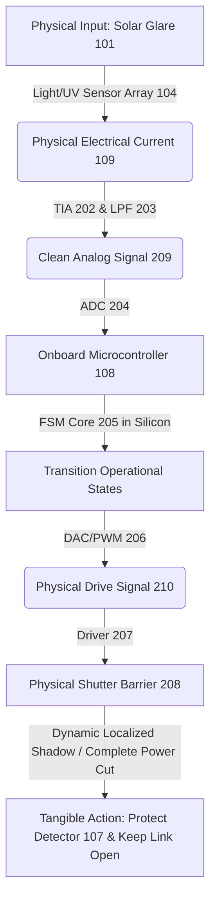
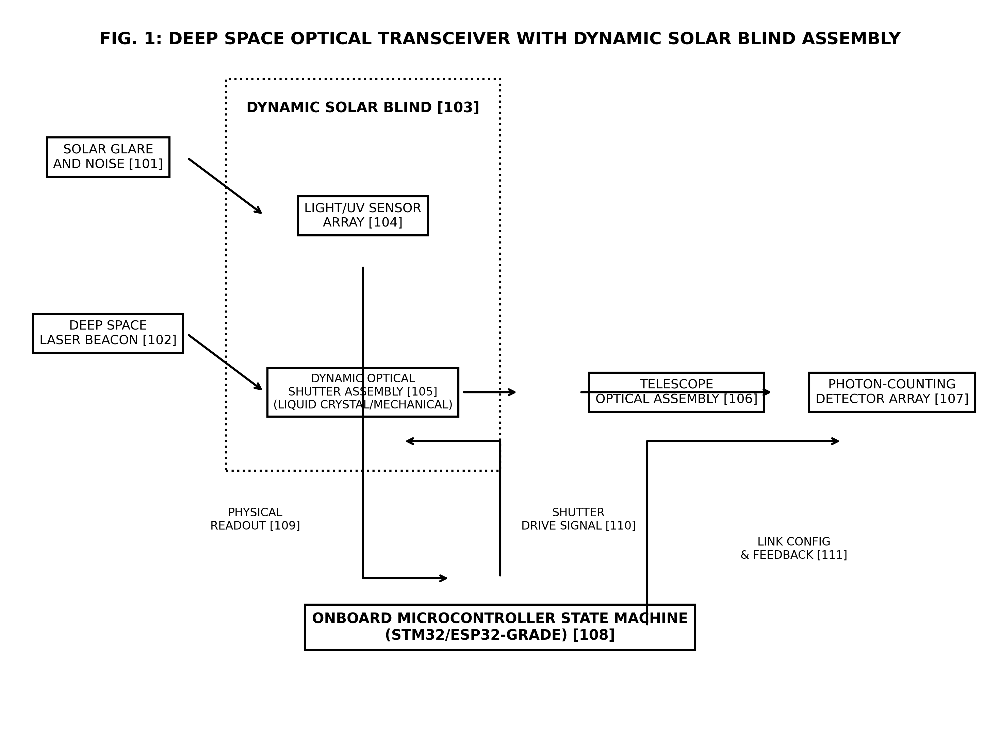
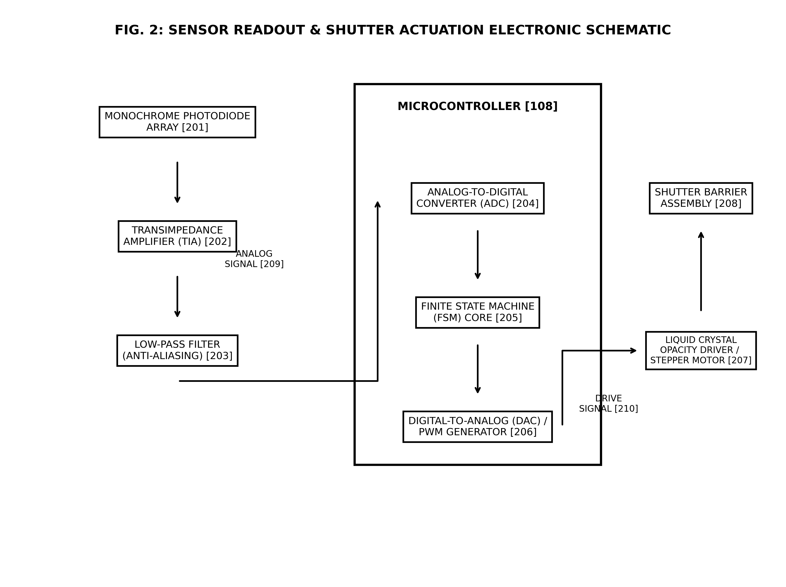
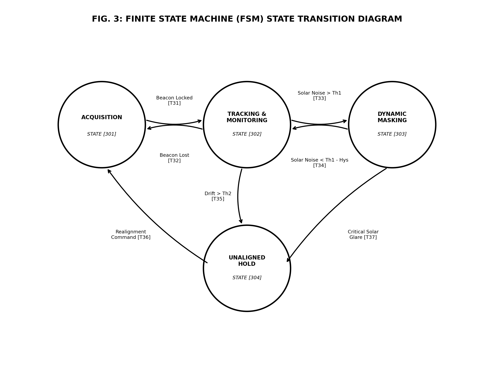
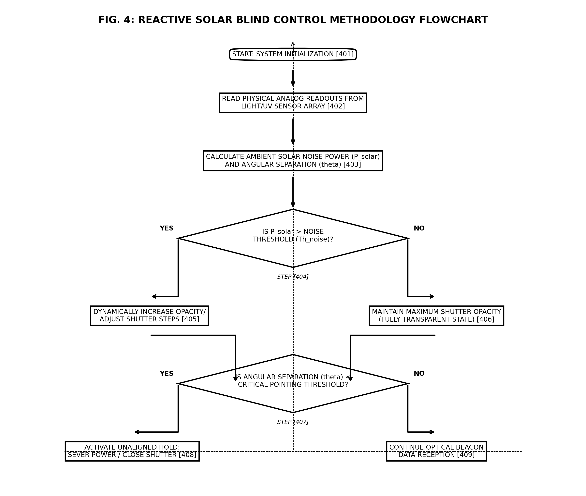

# COMPLETE INDIAN PATENT APPLICATION PACKAGE
## Reactive Masking System ("Dynamic Solar Blind") for Deep Space Optical Receivers

This document contains the complete technical-legal package for filing an Indian utility patent application for the **Reactive Masking System ("Dynamic Solar Blind")**. 

---

## 1. LEGAL-TECHNICAL STRATEGY & IP ARCHITECTURE

Filing a patent that involves software is legally challenging under both Section 3(k) of the Indian Patents Act, 1970 (which excludes "computer programmes per se or algorithms" from patentability) and similar laws internationally (e.g., 35 U.S.C. § 101 in the US). To ensure this patent is **bulletproof** against "abstract algorithm" rejections, we have framed it entirely as a **physical machine** that interacts with the physical world, performs conversions using a hardware-based state machine, and changes the physical state of the system to achieve a tangible, industrial utility.

### The Hardware-Software Structural Loop



1. **The Sensor Readout (Physical Input):** 
   The application does not start with an abstract data input. Instead, it relies on a physical **Light/UV Sensor Array [104]** composed of multiple monochrome **Photodiodes [201]** converting environmental light intensities and solar glare into a **Physical Analog Electrical Signal [209]**.
2. **Onboard Microcontroller State Machine Processing (Transformation):** 
   The software logic is explicitly defined as a **Finite State Machine (FSM) Core [205]** running in the physical silicon of an **Onboard Microcontroller [108]**. State transitions (Acquisition, Tracking, Dynamic Masking, and Unaligned Hold) occur physically inside the microcontroller's logic gates and registers.
3. **Physical Hardware Action (Tangible Output):** 
   The system achieves utility by modifying physical reality:
   * **Active Selective Shielding:** The controller drives an **Active Shutter Barrier [208]** (segmented liquid crystals or mechanical occulting disk) to physically scatter light or cast a physical shadow, blocking solar glare while keeping the laser beacon path open.
   * **Hardware Decoupling:** In the Unaligned Hold State, a solid-state switch is physically opened, **severing the power line** to the sensitive **Photon-Counting Detector Array [107]** to prevent permanent damage from unaligned solar exposure.

By patenting this **hardware-software structural loop**, competitors cannot bypass your patent simply by rewriting the code in a different language. As long as their receiver reads a physical sensor, processes it on a chip, and dynamically modifies a physical barrier or power line to mitigate solar noise, they will infringe on your patent.

---

## 2. LABELED PATENT DRAWINGS

The following clean, black-and-white drawings have been generated and saved directly in your workspace. They conform to the strict requirements of patent offices (clear borders, no unnecessary shading, and explicit reference numerals mapping to the specification).

### FIG. 1: System Block Diagram
This figure illustrates the high-level hardware layout of the transceiver, showing how the solar glare [101] and laser beacon [102] interact with the sensor array [104], the shutter barrier [105], and how the microcontroller [108] coordinates the closed-loop feedback.



*   **[101]** Solar Glare and Noise (Environmental Input)
*   **[102]** Deep Space Laser Beacon (Target Signal)
*   **[103]** Dynamic Solar Blind Assembly (System Boundary)
*   **[104]** Light/UV Sensor Array
*   **[105]** Dynamic Optical Shutter Assembly
*   **[106]** Telescope Optical Assembly
*   **[107]** Photon-Counting Detector Array (e.g., SNSPDs)
*   **[108]** Onboard Microcontroller State Machine
*   **[109]** Physical Sensor Readout (Analog Current)
*   **[110]** Shutter Drive Signal
*   **[111]** Link Configuration & Feedback Telemetry

---

### FIG. 2: Detailed Electronic Schematic & Optical Layout
This figure illustrates the exact signal chain, from the light sensors to the analog front-end (TIA and filters), entering the microcontroller ADC, and the subsequent digital-to-analog/PWM control path driving the physical shutter.



*   **[201]** Monochrome Photodiode Array (Quadrant arrangement)
*   **[202]** Transimpedance Amplifier (TIA)
*   **[203]** Low-Pass Anti-Aliasing Filter
*   **[204]** Analog-to-Digital Converter (ADC)
*   **[205]** Finite State Machine (FSM) Core in Silicon
*   **[206]** DAC / PWM Generator
*   **[207]** Liquid Crystal Opacity Driver / Stepper Motor Controller
*   **[208]** Shutter Barrier Assembly (LC array or mechanical disk)
*   **[209]** Clean Analog Signal
*   **[210]** Shutter Drive Signal

---

### FIG. 3: Finite State Machine (FSM) State Transition Diagram
This figure demonstrates the state-space and specific conditions governing the physical transitions of the microcontroller processor core, highlighting the integration of noise threshold hysteresis and pointing drift fail-safes.



*   **[301]** State 1: Deep Space Acquisition State (Fully open)
*   **[302]** State 2: Tracking & Monitoring State (Solar monitoring active)
*   **[303]** State 3: Dynamic Masking State (Localized opacity / shadow active)
*   **[304]** State 4: Unaligned Hold State (Failsafe shutdown & block active)
*   **[T31]** Transition: Laser Beacon Locked
*   **[T32]** Transition: Laser Beacon Lost
*   **[T33]** Transition: Solar Noise exceeds $Th_{noise}$
*   **[T34]** Transition: Solar Noise drops below $Th_{noise} - Hysteresis$
*   **[T35]** Transition: Angular pointing separation drops below $Th_{pointing}$
*   **[T36]** Transition: Realignment & Recovery Command
*   **[T37]** Transition: Critical Solar Glare detected (Extreme drift)

---

### FIG. 4: Operational Flowchart
This figure details the continuous logic loop executed by the microcontroller to dynamically calculate parameters and actuate hardware, showing both the masking branch and the failsafe shutdown branch.



*   **[401]** Start: System Initialization & Threshold Loading
*   **[402]** Read Physical Analog Readouts from Light/UV Sensor Array
*   **[403]** Calculate Solar Noise Power ($P_{solar}$) and Angular Separation ($\theta$)
*   **[404]** Decision: Is Solar Noise ($P_{solar}$) greater than Threshold ($Th_{noise}$)?
*   **[405]** Step: Dynamically increase opacity or adjust mechanical steps in resolved vector
*   **[406]** Step: Maintain maximum transparent state (Shutter inactive)
*   **[407]** Decision: Is Angular Separation ($\theta$) less than Pointing Threshold ($Th_{pointing}$)?
*   **[408]** Step: Activate Unaligned Hold (Sever power to detectors, fully close shutter)
*   **[409]** Step: Continue normal data reception and tracking

---

## 3. FORM 2 -- COMPLETE SPECIFICATION

Below is the complete, fileable technical specification text formatted as required by the Indian Patent Office.

> [!NOTE]
> This text corresponds exactly to the LaTeX source file `Form_2_Complete_Specification.tex` generated in your workspace.

```
FORM 2
THE PATENTS ACT, 1970
(39 of 1970)
&
THE PATENT RULES, 2003
COMPLETE SPECIFICATION
(See Section 10 and Rule 13)

1. TITLE OF THE INVENTION
A REACTIVE MASKING SYSTEM AND METHOD FOR DEEP SPACE OPTICAL RECEIVERS TO MITIGATE SOLAR BLINDING

2. APPLICANT(S)
Name: JASON
Nationality: Indian National
Address: SPICE-ns-Project, Dept. of Aerospace Engineering,
         Indian Institute of Space Science and Technology (IIST),
         Valiamala, Thiruvananthapuram – 695547, Kerala, India.

3. PREAMBLE TO THE DESCRIPTION
The following specification particularly describes the invention and the manner in which it is to be performed:
```

### FIELD OF THE INVENTION
The present disclosure generally relates to the field of deep space optical communications. More particularly, the present invention relates to an active optoelectronic and mechanical reactive masking system and method (also referred to as a "Dynamic Solar Blind") for deep space optical receivers, which dynamically detects solar glare and physical pointing anomalies to actively shield sensitive photon-counting sensors during low-solar-elongation phases (such as Solar Conjunction), thereby maintaining communication link availability and preventing hardware damage.

### BACKGROUND OF THE INVENTION AND PRIOR ART
Deep-space laser communications, such as NASA's Deep Space Optical Communications (DSOC) system, operate across millions of kilometers, requiring extremely high-gain optical receivers equipped with sensitive photon-counting sensor arrays, such as Superconducting Nanowire Single-Photon Detectors (SNSPDs) or Photomultiplier Tubes (PMTs). These detectors are designed to register individual photons of an incoming deep-space laser beacon.

However, when a spacecraft passes close to the Sun from the Earth's perspective—a celestial geometry known as Solar Conjunction or low solar elongation—the optical receiver is forced to point in close angular proximity to the solar disk. The intense, unpolarized solar glare and ambient solar noise overwhelm the optical receiver. This solar noise floods the sensitive photon-counting sensors, blinding them, corrupting the incoming optical data link, and, in severe cases, causing permanent catastrophic thermal and structural damage to the microscopic detector elements.

Prior art methods to mitigate solar blinding in optical receivers primarily rely on:
1. **Passive Spectral Bandpass Filters:** These are thin-film optical filters designed to pass only the specific wavelength of the laser beacon (e.g., 1550 nm) and block other wavelengths. However, in-band solar noise (photons matching the beacon wavelength) still passes through, blinding the detector when the angular separation is extremely small.
2. **Passive Mechanical Baffles:** Cylindrical baffles extending from the telescope aperture block stray light entering at oblique angles. However, during low-solar-elongation phases (e.g., angular separation less than 3 degrees), the solar disk is within the direct field of view of the telescope, rendering passive baffles entirely ineffective.
3. **Complete System Shutdown:** To prevent permanent detector damage, existing missions shut down the optical receiver entirely when the solar elongation angle falls below a critical threshold (typically 1.5 to 3 degrees), leading to severe communication blackouts that can last for weeks or months.

Therefore, there exists a critical technical need for a localized, sensor-driven reactive masking system that can dynamically and selectively mask the intense glare of the Sun over the telescope optics while keeping the optical path of the deep space laser beacon wide open, thereby preserving link availability during low-solar-elongation phases without risking detector destruction.

### OBJECT OF THE INVENTION
The primary object of the present invention is to provide a localized, sensor-driven reactive masking system for deep-space optical transceivers that maintains optical link availability during low-solar-elongation phases.

Another object of the present invention is to provide an active, closed-loop optoelectronic and mechanical shutter assembly that dynamically masks solar glare at precise angular vectors while leaving the target laser path unobstructed.

Yet another object of the present invention is to implement an onboard physical microcontroller state machine that processes analog environmental sensor signals in real-time, transitioning between distinct operational states in physical silicon to execute rapid, deterministic hardware protection routines.

A further object of the present invention is to provide a method that continuously monitors solar noise levels and angular separation, dynamically adjusting shutter opacity and micro-steps to mitigate solar blinding.

### SUMMARY OF THE INVENTION
The present invention achieves the aforementioned objectives by providing a specialized, hardware-software co-designed structural loop that converts an environmental solar glare anomaly into a physical hardware action.

In accordance with the present invention, a reactive masking system for a deep space optical receiver comprises:
*   A light/UV sensor array comprising a multi-element monochrome photodiode array positioned adjacent to a telescope optical assembly. The sensor array converts the physical environmental solar glare into a physical analog electrical signal representing solar noise intensity and its angular vector.
*   An onboard microcontroller communicatively coupled to the sensor array. The microcontroller comprises an Analog-to-Digital Converter (ADC) that digitizes the analog electrical signal, and a processor that executes a Finite State Machine (FSM) core implemented in physical silicon. The FSM core transitions between distinct operational states based on comparisons of digitized sensor readings with predetermined thresholds stored in physical, non-volatile memory registers.
*   A dynamic optical shutter assembly comprising a physical shutter barrier assembly (such as a segmented liquid-crystal cell array or a micro-stepped mechanical occulting disk) driven by a shutter driver. The shutter driver is electrically controlled by a physical digital-to-analog converter (DAC) or PWM drive signal generated by the microcontroller.

During a low-solar-elongation phase, when the solar glare exceeds a first predetermined threshold, the FSM core transitions to a "Dynamic Masking State", causing the microcontroller to generate a specific analog drive signal. This signal drives the physical shutter barrier assembly to dynamically increase its opacity or mechanical position at the exact angular coordinates of the Sun, thereby masking the glare while maintaining an unobstructed path for the deep-space laser beacon.

Furthermore, if the angular separation drops below a second critical pointing threshold, the FSM core transitions to an "Unaligned Hold State", wherein the microcontroller electronically opens a solid-state transistor switch to physically sever power to the photon-counting detector array, while simultaneously driving the shutter barrier to maximum opacity, physically isolating and protecting the sensitive optics from direct solar destruction.

### BRIEF DESCRIPTION OF THE ACCOMPANYING DRAWINGS
To facilitate a comprehensive understanding of the structural layout, electrical configuration, and operational logic of the present invention, reference is made to the accompanying drawings, which form a part of this specification:
*   **FIG. 1** is a high-level structural block diagram of the deep space optical transceiver system equipped with the dynamic solar blind assembly, illustrating the physical hardware-software loop.
*   **FIG. 2** is a detailed electronic schematic and optical layout of the sensor readout and shutter actuation interface.
*   **FIG. 3** is a state transition diagram of the Finite State Machine (FSM) core executed within the onboard microcontroller.
*   **FIG. 4** is a detailed operational flowchart illustrating the control methodology for dynamic solar masking and hardware protection.

### DETAILED DESCRIPTION OF THE INVENTION
Referring now to the drawings, wherein like reference numerals represent identical or corresponding parts throughout the several views, the physical architecture and operation of the reactive masking system are described in detail.

#### 1. System Architecture (FIG. 1 \& FIG. 2)
As illustrated in FIG. 1, the system is designed to operate in an outer space environment where a telescope optical assembly [106] receives an incoming deep space laser beacon [102] in close angular proximity to intense solar glare and ambient noise [101]. The telescope optical assembly [106] focuses the received optical signals onto a sensitive photon-counting detector array [107] (such as an array of superconducting nanowire single-photon detectors).

To prevent the solar glare [101] from entering the telescope optics and blinding or destroying the detector array [107], a dynamic solar blind assembly [103] is mounted directly in front of or within the telescope optical path. The dynamic solar blind assembly [103] comprises a light/UV sensor array [104] and a dynamic optical shutter assembly [105].

The light/UV sensor array [104] comprises a plurality of monochrome photodiodes [201] (shown in FIG. 2) optimized for ultraviolet and visible light detection. The sensor array [104] is physically positioned adjacent to the telescope aperture, oriented to face the incoming solar glare [101]. The sensor array [104] generates a physical electrical current (analog readout [109]) proportional to the ambient solar glare intensity.

This physical electrical current is routed to a transimpedance amplifier (TIA) [202] (FIG. 2), which converts the low-level current into a proportional voltage signal. This voltage signal is passed through a low-pass anti-aliasing filter [203] to eliminate high-frequency electromagnetic interference, producing a clean analog signal [209] that represents the physical environmental solar noise.

The analog signal [209] is electrically coupled to the analog input channel of an onboard digital microcontroller [108] (such as an STM32-grade ARM Cortex-M4 or an ESP32-grade dual-core microcontroller). The microcontroller [108] comprises an Analog-to-Digital Converter (ADC) [204] which digitizes the analog signal [209] into a multi-bit digital representation.

The digitized sensor data is processed in real-time by a Finite State Machine (FSM) core [205] executed in the physical silicon processor of the microcontroller [108]. The FSM core [205] monitors the solar noise intensity and the angular separation of the Sun relative to the telescope optical axis (derived from the differential voltage between different photodiodes in the quadrant array [201]).

Based on the FSM state, the microcontroller [108] generates a physical digital-to-analog (DAC) or Pulse-Width Modulation (PWM) drive signal [210] using an onboard DAC/PWM generator [206]. This drive signal [210] is electrically coupled to a liquid crystal opacity driver or a stepper motor controller [207], which physically actuates a shutter barrier assembly [208] inside the dynamic optical shutter assembly [105]. The shutter driver [207] generates the high-voltage AC bias or physical motor steps required to alter the state of the shutter barrier assembly [208], thereby dynamically masking the solar glare [101] while keeping the path for the laser beacon [102] wide open.

The microcontroller [108] also maintains a communicative link [111] with the telescope optical assembly [106] and detector array [107] to receive tracking feedback and dynamically configure detector gate timings to match the shutter actuation.

#### 2. Finite State Machine Operation (FIG. 3)
The software logic of the present invention is strictly framed as a physical hardware state machine executed on the silicon processor of the microcontroller [108]. As illustrated in FIG. 3, the FSM core [205] transitions between four distinct, hardware-constrained operational states stored in physical non-volatile memory registers:

1.  **Deep Space Acquisition State [301]:** In this state, the system is actively searching for the deep-space laser beacon [102]. The physical shutter barrier assembly [208] is set to a fully transparent state (minimum opacity) to maximize optical throughput.
2.  **Tracking \& Monitoring State [302]:** Once the laser beacon is locked (Transition [T31]), the FSM transitions to State [302]. The microcontroller [108] continuously polls the ADC [204] to monitor the solar noise level. If the laser beacon lock is lost (Transition [T32]), the FSM transitions back to the Acquisition State [301].
3.  **Dynamic Masking State [303]:** When the digitized solar noise exceeds a first predetermined threshold ($Th_{noise}$) stored in a non-volatile register (Transition [T33]), the FSM transitions to State [303]. The microcontroller [108] computes the angular vector of the solar glare [101] and transmits a physical drive signal [210] to the driver [207]. The driver [207] applies a localized electrical bias to a specific segment of the liquid-crystal shutter barrier [208], or drives a stepper motor to position a mechanical micro-mask, physically casting a shadow over the solar glare's path into the telescope while leaving the laser beacon path clear. To prevent rapid, destructive oscillation of the shutter under marginal noise conditions, the FSM transitions back to State [302] (Transition [T34]) only when the solar noise level falls below the threshold by a predetermined hysteresis value ($Th_{noise} - Hysteresis$).
4.  **Unaligned Hold State [304]:** If the telescope experiences a pointing drift or angular perturbation such that the calculated angular separation between the laser path and the Sun is less than a critical pointing threshold ($Th_{pointing}$) (Transition [T35] or [T37]), the FSM transitions to the Unaligned Hold State [304]. Transitioning to State [304] triggers an immediate, hardwired hardware safety action: the microcontroller [108] outputs a digital low signal to open a solid-state transistor switch (e.g., a MOSFET), physically severing the power line to the high-voltage bias of the photon-counting detector array [107]. Simultaneously, the driver [207] is commanded to set the entire shutter barrier assembly [208] to maximum opacity (fully closed), physically sealing the telescope optics from direct sunlight. The FSM remains in this state until a safe realignment command is received from the ground station or onboard guidance computer (Transition [T36]), resetting the system back to the Acquisition State [301].

#### 3. Detailed Control Methodology (FIG. 4)
FIG. 4 outlines the step-by-step operational method executed by the reactive masking system.
The method begins at Step [401] with system initialization, where default calibration values and thresholds ($Th_{noise}$, $Th_{pointing}$, $Hysteresis$) are loaded from physical non-volatile EEPROM registers into the processor SRAM.

At Step [402], the microcontroller [108] continuously reads the physical analog electrical readouts [109] generated by the light/UV sensor array [104], digitizing them via the internal multi-channel ADC [204].

At Step [403], the microcontroller processor calculates the real-time ambient solar noise power ($P_{solar}$) and the angular separation ($\theta$) of the Sun relative to the telescope optical axis by evaluating the differential signal levels across the photodiode quadrant array [201].

At Step [404], the FSM core [205] compares the calculated $P_{solar}$ with the first threshold $Th_{noise}$.
If $P_{solar} > Th_{noise}$ ("YES" branch), the process flows to Step [405], where the microcontroller [108] transitions to the Dynamic Masking State [303] and dynamically increases the opacity or adjusts the physical mechanical micro-steps of the shutter barrier [208] in the direction of the resolved angular vector to mask the glare.
If $P_{solar} \le Th_{noise}$ ("NO" branch), the process flows to Step [406], where the microcontroller [108] maintains the shutter barrier [208] in a fully transparent state.

From both Steps [405] and [406], the process flows to Step [407], where the FSM core [205] evaluates whether the angular separation $\theta$ is less than the critical pointing threshold $Th_{pointing}$.
If $\theta < Th_{pointing}$ ("YES" branch), the process flows to Step [408], where the FSM core [205] activates the Unaligned Hold State [304], physically opening a solid-state switch to sever power to the photon detectors [107] and closing the shutter [208] completely to prevent solar damage.
If $\theta \ge Th_{pointing}$ ("NO" branch), the process flows to Step [409], and the system continues normal optical data reception.
The loop continuously repeats, feeding back to the initial sensor readouts to ensure dynamic, real-time protection and link maintenance.

#### 4. Working Embodiments
In a first practical embodiment, the shutter barrier assembly [208] comprises a segmented liquid-crystal (LC) array placed at an intermediate conjugate image plane of the telescope optical assembly [106]. The LC array consists of 64 concentric and radial segments, each independently wired to the driver [207]. When the sensor array [104] resolves that the solar glare [101] is entering at a specific angular bearing, the microcontroller [108] computes which segment of the LC array aligns with the solar ray path and applies an AC bias voltage (e.g., 5V RMS at 1 kHz) to that specific segment. This physically transitions the liquid crystals in that segment from a parallel aligned transparent state to a highly scattering, opaque homeotropic or twisted state, casting a localized shadow over the solar glare while the remaining 63 segments remain fully transparent, allowing the deep space laser beacon [102] to pass through unobstructed.

In a second practical embodiment, the shutter barrier assembly [208] comprises a mechanical micro-shutter. The driver [207] comprises a high-precision bipolar stepper motor coupled to a lead screw. The shutter barrier [208] is a physical molybdenum or carbon-composite occulting disk. When solar noise exceeds the threshold, the microcontroller [108] calculates the necessary micro-steps and drives the stepper motor [207] to translate the physical occulting disk across the aperture, blocking the solar path.

Both embodiments demonstrate how the physical inputs from the sensors [104] are converted into physical transformations in the silicon microcontroller [108] and translated into physical, mechanical, or optoelectronic changes in the shutter barrier [208] to achieve the tangible utility of protecting the detectors [107] while maintaining link availability.

---

### CLAIMS (THE LEGAL BOUNDARIES)

We claim:

1.  A reactive masking system for a deep space optical receiver to maintain communication link availability during low-solar-elongation phases, the system comprising:
    *   a telescope optical assembly [106] configured to focus an incoming deep space laser beacon [102] along an optical path onto a photon-counting detector array [107];
    *   a dynamic optical shutter assembly [105] positioned along the optical path of the telescope optical assembly [106], the dynamic optical shutter assembly comprising a physical shutter barrier assembly [208] driven by a shutter driver [207];
    *   a light/UV sensor array [104] comprising a plurality of photodiodes [201] positioned adjacent to the telescope optical assembly [106], the light/UV sensor array [104] configured to generate a physical analog electrical signal [209] representing an intensity and an angular vector of incoming solar glare [101]; and
    *   an onboard microcontroller [108] comprising an analog-to-digital converter (ADC) [204], a non-volatile memory register, and a processor configured to execute a finite state machine (FSM) core [205] in physical silicon, the onboard microcontroller [108] being electrically coupled to the light/UV sensor array [104] and the shutter driver [207];
    
    wherein the onboard microcontroller [108] is configured to:
    *   digitize the physical analog electrical signal [209] via the ADC [204] to obtain a real-time solar noise value and an angular separation value;
    *   compare the solar noise value and the angular separation value with predetermined thresholds stored in the non-volatile memory register;
    *   transition the FSM core [205] from a normal tracking state [302] to a dynamic masking state [303] when the solar noise value exceeds a first predetermined threshold; and
    *   generate and transmit a physical drive signal [210] to the shutter driver [207] during the dynamic masking state [303], thereby physically adjusting the opacity or mechanical position of the physical shutter barrier assembly [208] to dynamically mask the solar glare [101] while keeping the optical path for the deep space laser beacon [102] open.
2.  The system of claim 1, wherein the light/UV sensor array [104] comprises a multi-element monochrome photodiode array arranged in a quadrant configuration to resolve the angular vector of the solar glare [101] relative to the optical axis of the telescope optical assembly [106].
3.  The system of claim 1, further comprising a transimpedance amplifier (TIA) [202] and a low-pass anti-aliasing filter [203] electrically coupled between the light/UV sensor array [104] and the ADC [204] of the microcontroller [108] to convert and filter the physical electrical signal prior to digitization.
4.  The system of claim 1, wherein the physical shutter barrier assembly [208] comprises a segmented liquid-crystal cell array, and the shutter driver [207] is an AC voltage bias driver configured to dynamically vary the liquid crystal opacity in discrete spatial segments.
5.  The system of claim 1, wherein the physical shutter barrier assembly [208] comprises a mechanical micro-mask driven by a stepper motor [207] configured to mechanically translate a physical occulting disk across a portion of the telescope aperture in micro-steps.
6.  The system of claim 1, wherein the FSM core [205] is configured to transition from the dynamic masking state [303] back to the normal tracking state [302] only when the solar noise value drops below the first predetermined threshold by a predetermined hysteresis value, preventing rapid oscillation of the shutter barrier assembly [208].
7.  The system of claim 1, wherein the FSM core [205] is configured to transition from the dynamic masking state [303] or the normal tracking state [302] to an unaligned hold state [304] when the angular separation value is less than a second predetermined pointing threshold; and
    wherein transitioning to the unaligned hold state [304] causes the microcontroller [108] to electronically open a solid-state transistor switch, thereby physically severing an electrical power line to the photon-counting detector array [107] and completely closing the physical shutter barrier assembly [208] to prevent permanent optical damage from direct solar exposure.
8.  The system of claim 1, wherein the onboard microcontroller [108] is a radiation-hardened 32-bit ARM Cortex-M4 or dual-core ESP32 microcontroller operating at a clock frequency of at least 80 MHz, configured to execute the FSM core [205] in real-time with a control loop latency of less than 10 milliseconds.
9.  A method for dynamically mitigating solar blinding in a deep space optical receiver using a localized reactive masking system, the method comprising:
    *   receiving an incoming deep space laser beacon [102] through a telescope optical assembly [106] onto a photon-counting detector array [107];
    *   generating, by a light/UV sensor array [104] comprising a plurality of photodiodes [201], a physical analog electrical signal [209] representing an intensity and an angular vector of incoming solar glare [101];
    *   digitizing the physical analog electrical signal [209] via an analog-to-digital converter (ADC) [204] of an onboard microcontroller [108] to obtain a real-time solar noise value and an angular separation value;
    *   comparing, by a processor of the onboard microcontroller [108] executing a finite state machine (FSM) core [205] in physical silicon, the solar noise value and the angular separation value with predetermined thresholds stored in a non-volatile memory register;
    *   transitioning the FSM core [205] from a normal tracking state [302] to a dynamic masking state [303] when the solar noise value exceeds a first predetermined threshold;
    *   generating and transmitting, by a digital-to-analog converter (DAC) or PWM generator [206] of the microcontroller [108], a physical drive signal [210] to a shutter driver [207] during the dynamic masking state [303]; and
    *   physically adjusting, by the shutter driver [207] responding to the drive signal [210], the opacity or mechanical position of a physical shutter barrier assembly [208] positioned along the optical path of the telescope optical assembly [106] to dynamically mask the solar glare [101] while keeping the optical path for the deep space laser beacon [102] open.
10. The method of claim 9, wherein physically adjusting the opacity comprises applying an AC bias voltage to a specific spatial segment of a liquid-crystal cell array [208] corresponding to the angular vector of the solar glare [101], creating a localized high-opacity shadow zone while keeping remaining segments of the array in a fully transparent state.
11. The method of claim 9, wherein physically adjusting the mechanical position comprises driving a stepper motor [207] to translate a mechanical occulting disk [208] across the telescope aperture, aligning the disk's physical shadow with the angular vector of the solar glare [101].
12. The method of claim 9, further comprising:
    *   transitioning the FSM core [205] to an unaligned hold state [304] when the angular separation value is less than a second predetermined pointing threshold; and
    *   triggering, by the FSM core [205] in the unaligned hold state [304], a solid-state switch to physically disconnect electrical power from the photon-counting detector array [107] and driving the physical shutter barrier assembly [208] to its maximum opacity state to block all incoming light.

---

### ABSTRACT OF THE DISCLOSURE
A reactive masking system and method are disclosed to maintain communication link availability and protect high-gain optical receivers in deep space optical communication systems during low-solar-elongation phases. The system comprises a telescope optical assembly [106], a photon-counting detector array [107], a dynamic optical shutter assembly [105] with a physical shutter barrier assembly [208] (such as a segmented liquid-crystal cell array or a mechanical occulting disk), and a light/UV sensor array [104]. An onboard microcontroller [108] runs a Finite State Machine (FSM) core [205] in physical silicon. The microcontroller [108] digitizes environmental solar glare signals via an ADC [204]. If solar noise exceeds a threshold, the FSM transitions to a dynamic masking state, generating a drive signal to adjust the shutter opacity or position, dynamically blocking solar glare while keeping the laser beacon path open. If pointing drifts below a critical threshold, the FSM transitions to an unaligned hold state, physically cutting power to the detectors to prevent solar destruction.

---

## 4. ADMINISTRATIVE FORMS PREVIEW

The following is an overview of the administrative forms drafted in your workspace. You must file these together with Form 2.

### Form 1: Application for Grant of Patent
*   **Purpose:** Formal administrative registration.
*   **Crucial Sections:**
    *   *Applicant & Inventor Table:* Labeled with your name (JASON), nationality (Indian), and address at the Indian Institute of Space Science and Technology (IIST).
    *   *Declarations:* Signed statements certifying ownership and possessorship of the invention.

### Form 3: Statement and Undertaking Under Section 8
*   **Purpose:** Declare any corresponding foreign filings.
*   **Crucial Sections:**
    *   *Section 8(1):* Declares no current foreign applications have been filed.
    *   *Section 8(2):* Legally binding undertaking promising to inform the Indian Patent Office of any foreign filings within 6 months.

### Form 5: Declaration as to Inventorship
*   **Purpose:** Formal declaration certifying that you are the true and first inventor.
*   **Crucial Sections:**
    *   *Section 10(6):* Signed declaration matching the details on Form 1 and Form 2.

---

## 5. ACTIONABLE ROADMAP FOR IPO FILING

Filing a patent in India can be completed online via the Comprehensive e-Filing Portal of the Controller General of Patents, Designs and Trade Marks (CGPDTM). Below is the exact step-by-step protocol to file this package.

### Step 1: Create a Digital Signature Certificate (DSC)
In India, e-filing requires a **Class III Digital Signature Certificate (DSC)**. 
1. Obtain a Class III DSC from an authorized Certifying Authority (CA) in India (e.g., eMudhra, Capricorn, or Sify).
2. Install the DSC drivers on your computer and verify the certificate is active.

### Step 2: Register on the Comprehensive e-Filing Portal
1. Navigate to the official portal: [ipindiaonline.gov.in/epatentfiling](https://ipindiaonline.gov.in/epatentfiling).
2. Click on "New User Registration" and create an applicant account using your DSC.
3. Once registered, log into the portal using your User ID, Password, and DSC.

### Step 3: Complete and Upload the Forms
Once logged in, navigate to "New Application" -> "Patent Filing" and upload the documents in the following sequence:

| Form Name | Filename in Workspace | Description | Mandatory / Optional |
|---|---|---|---|
| **Form 1** | `Form_1_Application.tex` | Application for Grant of Patent (administrative details) | **Mandatory** |
| **Form 2** | `Form_2_Complete_Specification.tex` | Complete Specification (technical description, claims, abstract) | **Mandatory** |
| **Drawings** | `figure_1.png` to `figure_4.png` | Labeled drawings referenced in Form 2 | **Mandatory** |
| **Form 3** | `Form_3_Statement_Undertaking.tex` | Section 8 foreign filing statement | **Mandatory** (Within 6 months) |
| **Form 5** | `Form_5_Declaration_Inventorship.tex` | Declaration of inventorship | **Mandatory** (Within 1 month) |
| **Form 9** | *Generated on Portal* | Request for Publication (Publishes patent in 1 month instead of 18 months) | Optional (Highly Recommended) |
| **Form 18** | *Generated on Portal* | Request for Examination (Queues application for Examiner review) | **Mandatory** (Within 48 months) |

> [!TIP]
> **Expedited Examination (Form 18A):** As an individual applicant or startup, you are eligible for **Expedited Examination** under Rule 24C. Filing Form 18A instead of Form 18 fast-tracks your application, reducing examination times from 3-4 years to just **6-12 months**!

### Step 4: Fee Structure (Individual/Startup Rates)
The IPO offers a **80% fee concession** for individuals, startups, and educational institutions. Below are the statutory e-filing fees:

*   **Form 1 (Filing Fee):** ₹1,600 (Normal rate: ₹8,000)
*   **Form 9 (Early Publication):** ₹2,500 (Normal rate: ₹12,500)
*   **Form 18 (Request for Examination):** ₹4,000 (Normal rate: ₹20,000)
*   **Form 18A (Expedited Examination - Startup/Individual alternative):** ₹8,000 (Normal rate: ₹40,000)

**Total Minimum Upfront Cost (Filing + Early Pub + Fast-Track Exam):** **₹12,100**

### Step 5: Timeline Post-Filing
```
[Day 0: File Application (Form 1, 2, 3, 5)] 
       │
       ▼
[Month 1: Early Publication (Form 9 active)] ── (Normally 18 months without Form 9)
       │
       ▼
[Month 2: Request for Examination (Form 18A active)]
       │
       ▼
[Month 6-9: First Examination Report (FER) Issued] ── (You have 6 months to respond)
       │
       ▼
[Month 12-15: Hearing & Final Decision] 
       │
       ▼
[GRANT OF INDIAN PATENT (Monopoly for 20 Years)]
```

---

## 6. LAUNCHING THE COMPILATION
Since `pdflatex` is not directly in the environment path, you can compile these files into beautiful, publication-ready PDFs by:
1. Uploading the generated `.tex` files and `.png` images directly to **Overleaf.com** (set compiler to PDFLaTeX).
2. Or, run the following command in a terminal where TeX Live is installed:
   ```bash
   pdflatex Form_2_Complete_Specification.tex
   pdflatex Form_1_Application.tex
   pdflatex Form_3_Statement_Undertaking.tex
   pdflatex Form_5_Declaration_Inventorship.tex
   ```
