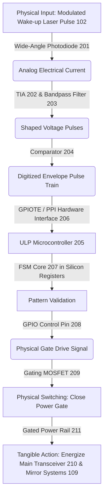
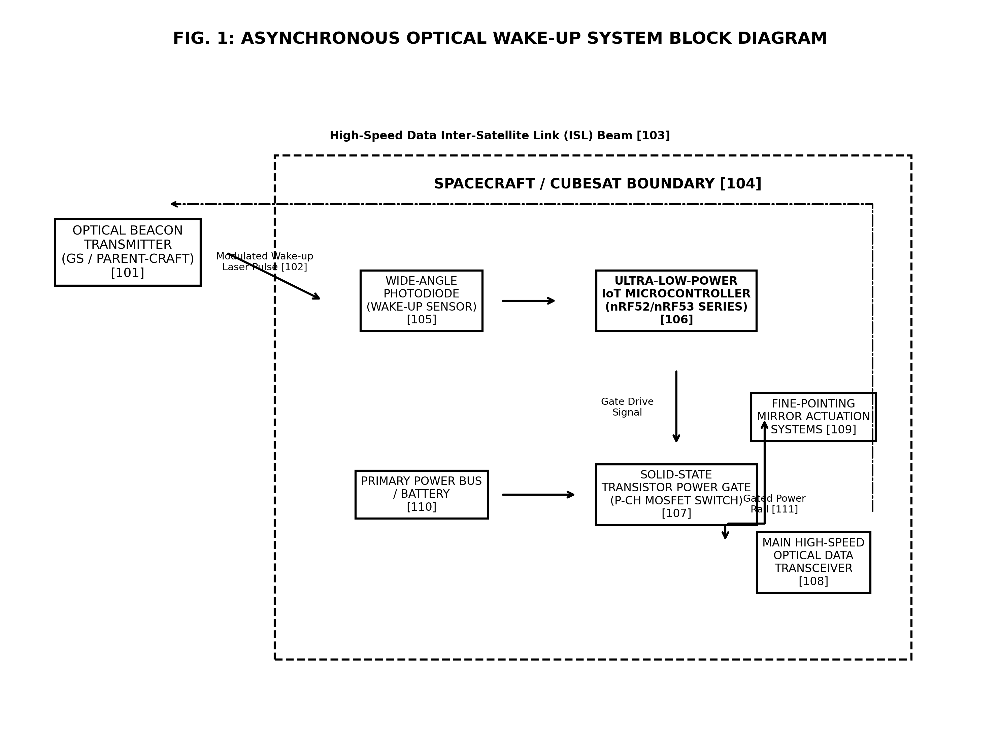
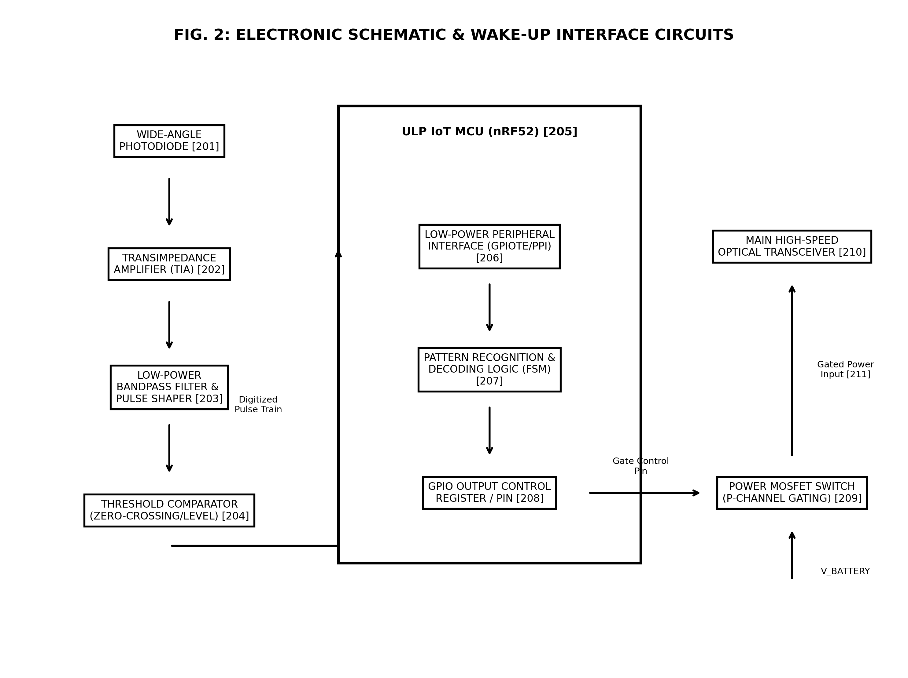
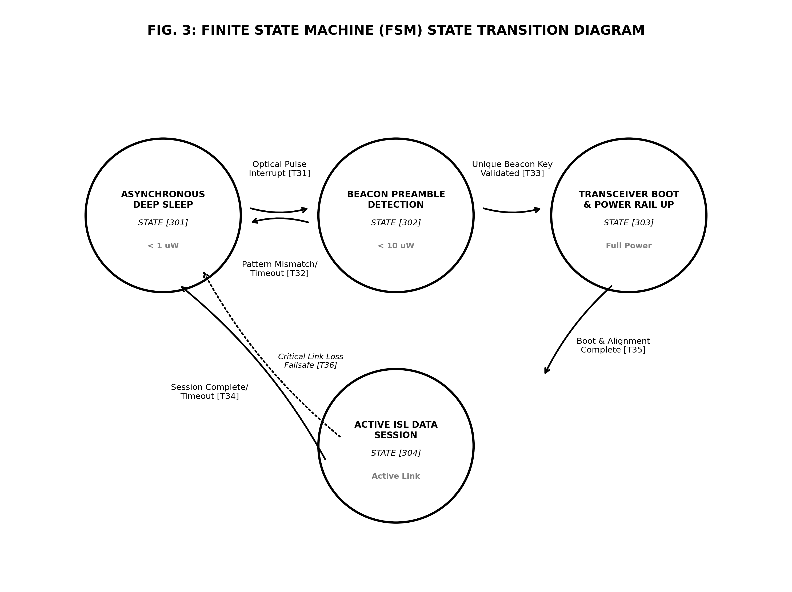
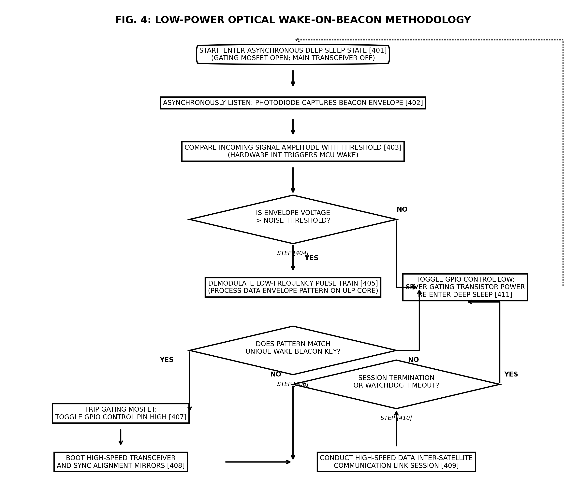

# COMPLETE INDIAN PATENT APPLICATION PACKAGE
## Asynchronous Optical Wake-up Architecture and Low-power Hardware Gating Method for Deep-space Small Satellite Transceivers

This document contains the complete technical-legal package for filing an Indian utility patent application for the **Asynchronous Optical Wake-up and Power-Gating System**.

---

## 1. LEGAL-TECHNICAL STRATEGY & IP ARCHITECTURE

Filing a patent involving software logic is legally challenging in India under **Section 3(k) of the Indian Patents Act, 1970** (which excludes "computer programmes per se or algorithms" from patentability), as well as internationally (such as under 35 U.S.C. § 101 in the United States). To ensure this patent is completely **bulletproof** against "abstract software" or "algorithm per se" rejections, the invention has been framed entirely as a **physical hardware-software structural loop** in physical silicon that gates primary hardware power rails to achieve a tangible, industrial utility (preventing battery starvation on small satellite platforms).

### The Hardware-Software Structural Loop



1. **The Sensor and Analog Front-End (Physical Input):** 
   The application does not receive abstract data. Instead, it relies on a physical **Wide-Angle Photodiode [201]** capturing a low-frequency **Modulated Wake-up Laser Pulse [102]** and converting it into a physical electrical current, which is then amplified by a **Transimpedance Amplifier (TIA) [202]**, filtered by an analog **Bandpass Filter [203]** to eliminate ambient solar glare, and digitized by a **Comparator [204]** to produce a physical **Digitized Envelope Pulse Train**.
2. **Onboard Microcontroller State Machine Processing (Transformation):** 
   The software logic is explicitly defined as a **Finite State Machine (FSM) Core [207]** running in the physical silicon of an **Onboard ULP Microcontroller [205]**. Preamble counting and event routing are managed by hardware-level gating (**GPIOTE and PPI [206]**), keeping the main CPU suspended. Only upon verifying signal presence is the CPU woke to perform hardware-level pattern validation against keys stored in non-volatile registers.
3. **Physical Hardware Action (Tangible Output):** 
   The system achieves utility by modifying physical reality:
   * **Power-Gate Gating:** Toggling the GPIO pin [208] generates a physical drive signal that closes a solid-state **MOSFET switch [209]**, allowing current to flow from a battery to a **Gated Transceiver Power Input [211]**.
   * **Payload Energization:** This physically boots a high-speed, high-power **Main Optical Transceiver [210]** and **Fine-Pointing Mirror Actuation Systems [109]** from a completely de-energized, zero-leakage state.

By patenting this **hardware-software structural loop**, competitors cannot bypass your patent simply by writing a different script or using a different programming language. As long as their receiver reads a physical optical sensor, routes pulses through low-power hardware, and dynamically closes a physical transistor switch to power up a main high-speed transceiver, they will infringe on your patent.

---

## 2. LABELED PATENT DRAWINGS

The following clean, black-and-white drawings have been generated and saved directly in your workspace and artifact directory. They conform to the strict requirements of patent offices (clear borders, no unnecessary shading, and explicit reference numerals mapping to the specification).

### FIG. 1: System Block Diagram
This figure illustrates the high-level hardware layout of the transceiver, demonstrating the satellite boundary [104], the primary power bus [110], the gating transistor [107], and how the ULP wake-up path controls power flow to the high-power communication payload [108, 109].



*   **[101]** Optical Beacon Transmitter (Ground Station or Mother-Craft)
*   **[102]** Modulated Wake-up Laser Pulse (Beacon signal)
*   **[103]** High-Speed Data Inter-Satellite Link (ISL) Beam (High-speed link)
*   **[104]** Spacecraft / CubeSat Boundary
*   **[105]** Wide-Angle Photodiode (Wake-up Sensor)
*   **[106]** Ultra-Low-Power IoT Microcontroller (nRF52/nRF53 Series)
*   **[107]** Solid-State Transistor Power Gate (MOSFET Switch)
*   **[108]** Main High-Speed Optical Data Transceiver
*   **[109]** Fine-Pointing Mirror Actuation Systems
*   **[110]** Primary Power Bus / Battery
*   **[111]** Gated Power Rail (Switched power bus)

---

### FIG. 2: Detailed Electronic Schematic & Interface Layout
This figure illustrates the exact signal chain, from the photodiode sensor to the analog front-end (TIA, bandpass filter, and comparator), entering the ULP microcontroller GPIOTE/PPI hardware module, and the subsequent digital gate control path.



*   **[201]** Wide-Angle Photodiode
*   **[202]** Transimpedance Amplifier (TIA)
*   **[203]** Low-Power Bandpass Filter & Pulse Shaper
*   **[204]** Threshold Comparator (Zero-crossing/level detector)
*   **[205]** ULP IoT Microcontroller (nRF52 Series)
*   **[206]** Low-Power Peripheral Interface (GPIOTE / PPI Hardware modules)
*   **[207]** Pattern Recognition & Decoding Logic (FSM core in silicon)
*   **[208]** GPIO Output Control Register / Pin
*   **[209]** Power MOSFET Switch (P-channel Gating Transistor)
*   **[210]** Main High-Speed Optical Transceiver
*   **[211]** Gated Transceiver Power Input

---

### FIG. 3: Finite State Machine (FSM) State Transition Diagram
This figure demonstrates the state-space and specific conditions governing the physical transitions of the microcontroller processor core, highlighting the power consumption levels in each state.



*   **[301]** State 1: Asynchronous Deep Sleep State ($<1\mu\text{W}$, default standby)
*   **[302]** State 2: Beacon Preamble Detection State ($<10\mu\text{W}$, hardware evaluation)
*   **[303]** State 3: Transceiver Boot & Power Rail Up State (Full power, transistor closed)
*   **[304]** State 4: Active ISL Data Session State (Active communication link)
*   **[T31]** Transition: Optical Pulse Interrupt detected (Wake event)
*   **[T32]** Transition: Pattern Mismatch or Timeout (Return to sleep)
*   **[T33]** Transition: Unique Beacon Key Validated (Boot main payload)
*   **[T34]** Transition: Session Complete or Timeout (Cut power, return to sleep)
*   **[T35]** Transition: Boot & Alignment Complete (Start active data exchange)
*   **[T36]** Transition: Critical Link Loss Failsafe (Immediate shutdown)

---

### FIG. 4: Operational Flowchart
This figure details the continuous logic loop executed by the microcontroller wake-up receiver to asynchronously monitor physical optical inputs, validate incoming data structures, and control the gating transistor.



*   **[401]** Start: Enter Asynchronous Deep Sleep State (MOSFET open, transceiver unpowered)
*   **[402]** Asynchronously Listen: Photodiode captures modulated optical energy
*   **[403]** Compare Incoming Signal Amplitude with Threshold (Comparator output)
*   **[404]** Decision: Is Envelope Voltage greater than Noise Threshold?
*   **[405]** Step: Demodulate Low-Frequency Pulse Train on ULP core
*   **[406]** Decision: Does Pattern Match Unique Wake Beacon Key?
*   **[407]** Step: Trip Gating MOSFET: Toggle GPIO Control Pin High (or Low)
*   **[408]** Step: Boot High-Speed Transceiver and Sync Alignment Mirrors
*   **[409]** Step: Conduct High-Speed Data Inter-Satellite Communication Session
*   **[410]** Decision: Session Termination or Watchdog Timeout?
*   **[411]** Step: Toggle GPIO Control Low: Sever Gating Transistor Power, Re-enter Sleep

---

## 3. FORM 2 -- COMPLETE SPECIFICATION

Below is the complete, fileable technical specification text formatted as required by the Indian Patent Office.

```
FORM 2
THE PATENTS ACT, 1970
(39 of 1970)
&
THE PATENT RULES, 2003
COMPLETE SPECIFICATION
(See Section 10 and Rule 13)

1. TITLE OF THE INVENTION
AN ASYNCHRONOUS OPTICAL WAKE-UP ARCHITECTURE AND LOW-POWER HARDWARE GATING METHOD FOR DEEP-SPACE SMALL SATELLITE TRANSCEIVERS

2. APPLICANT(S)
Name: Jason Pandian
Nationality: Indian National
Address: Nehru Institute of Technology, Coimbatore, Tamilnadu, India.

3. PREAMBLE TO THE DESCRIPTION
The following specification particularly describes the invention and the manner in which it is to be performed:
```

### FIELD OF THE INVENTION
The present disclosure generally relates to the field of deep-space optical satellite communications. More particularly, the present invention relates to an asynchronous optical wake-on-beacon system, a specialized hardware-software co-designed control loop, and a low-power gating method for deep-space small satellite or CubeSat transceivers. The system dynamically monitors low-frequency modulated laser wake-up signals asynchronously via a wide-angle, ultra-low-power optical front-end and executes pattern-decoding logic in physical silicon to gate the main primary power rail of a high-speed, high-power optical data transceiver and fine-pointing mirror systems, thereby maintaining sub-micro-watt power consumption during idle phases and extending spacecraft mission lifespan.

### BACKGROUND OF THE INVENTION AND PRIOR ART
Small satellites, such as CubeSats, MicroSats, and deep-space probes, are increasingly deployed for interplanetary exploration, lunar missions, and deep-space observation networks. These platforms operate under extremely constrained electrical energy budgets, typically relying on compact solar arrays and battery systems capable of generating only a few watts of continuous power. 

High-speed Inter-Satellite Links (ISL) and Deep-Space-to-Earth communications are transitionally shifting from radio frequency (RF) to optical laser communications due to the massive bandwidth and data rate advantages. However, high-speed optical transceivers, coarse-steering gimbals, and fine-pointing mirror assemblies (such as Fast Steering Mirrors or Micro-Electro-Mechanical Systems mirror arrays) consume substantial power during active operations (typically 10 to 50 watts). Furthermore, to establish a communication link, the transceiver and its complex spatial pointing, acquisition, and tracking (PAT) algorithms must traditionally remain powered on, actively scanning the sky or polling for incoming signals.

Keeping the high-speed receiver and PAT alignment algorithms running 24/7 drains immense battery power, which is entirely unsustainable for CubeSats or deep-space probes. For example, a CubeSat operating in deep space may only have opportunities to transmit or receive data once every few days when passing a ground station or mother-craft. Leaving the optical transceiver active in "listening mode" during these long idle periods results in rapid, catastrophic battery depletion, leading to complete power starvation and mission failure.

Prior art attempts to solve this low-power standby challenge include:
1. **Duty Cycling (Scheduled Wake-ups):** The spacecraft is programmed to boot the transceiver at precise, predetermined times synchronized with a ground station clock. However, clock drift over deep-space distances requires wide "guard bands" of active listening time. Furthermore, this method is entirely rigid and cannot handle asynchronous, unscheduled emergency communications or opportunistic links.
2. **Low-Power Radio Frequency (RF) Wake-up Receivers:** A low-power RF receiver remains active to catch an RF "wake-up" command, which then boots the high-power optical payload. However, RF propagation over deep-space distances suffers from high path loss, requires large, heavy antennas incompatible with CubeSat form factors, and is highly susceptible to solar RF noise and interference.
3. **Passive Optical Transceiver Polling:** The optical receiver periodically boots for a short duration to poll for an incoming laser beacon. While this reduces average power, the high-power transceiver must still cycle "on" and "off" regularly, consuming significant transient boot energy and reducing the reliability of high-frequency switching electronics.

Therefore, there exists a critical, unaddressed technical need for a fully asynchronous, passive, ultra-low-power optical wake-up architecture and low-power hardware gating method that can remain in a deep sleep state consuming less than one micro-watt, while retaining the capability to instantaneously and dynamically wake up the main transceiver and fine-pointing systems in response to a unique modulated laser beacon pulse from a ground station or mother-craft.

### OBJECT OF THE INVENTION
The primary object of the present invention is to provide an asynchronous optical wake-on-beacon system and method for deep-space small satellite transceivers that maintains a sub-micro-watt sleep state while enabling instantaneous, on-demand optical communication boot.

Another object of the present invention is to provide a low-power analog front-end and a wide-angle, passive wake-up sensor that captures modulated optical signals across a wide field of view without requiring active spatial alignment.

Yet another object of the present invention is to implement a hardware-software co-designed control loop where an ultra-low-power microcontroller operates in a hardware sleep state, utilizing hardware-gated peripheral interfaces to route and count digitized pulses without waking the central processing unit (CPU) core, thereby preserving energy during signal validation.

A further object of the present invention is to provide a low-power hardware gating method that utilizes a solid-state transistor switch (such as a P-channel MOSFET) to completely isolate the high-speed main data transceiver and fine-pointing mirror systems from the primary power bus during idle periods, reducing leakage current to virtually zero.

### SUMMARY OF THE INVENTION
The present invention achieves the aforementioned objectives by providing a specialized, hardware-software co-designed structural loop that converts a physical, low-frequency modulated environmental laser wake-up beacon pulse into a physical transistor gating action in silicon, powering up a main transceiver.

In accordance with the present invention, an asynchronous optical wake-up system for a deep-space small satellite comprises:
*   A wide-angle wake-up photodiode configured to capture an incoming, low-frequency modulated wake-up laser pulse. The photodiode operates as a basic, alignment-free wake-up sensor.
*   An analog front-end comprising a low-power transimpedance amplifier (TIA), a bandpass filter, and a threshold comparator. The front-end is configured to convert the weak physical optical beacon into a digitized envelope pulse train.
*   A solid-state transistor power gate (such as a P-channel enhancement-mode MOSFET switch) electrically connected between a primary power bus (battery) and a gated transceiver power rail.
*   A main high-speed optical data transceiver and a fine-pointing mirror system connected to the gated transceiver power rail. The main transceiver and mirrors remain completely unpowered when the transistor gate is open.
*   An ultra-low-power (ULP) IoT microcontroller (such as a Nordic Semiconductor nRF52-grade chip) communicatively coupled to the comparator and the gate of the MOSFET switch. The microcontroller executes a Finite State Machine (FSM) core implemented in physical silicon registers.

During an idle state, the main transceiver and mirror systems are unpowered ($0\mu\text{W}$). The ULP microcontroller remains in a hardware-based "Deep Sleep State" ($<1\mu\text{W}$) with its internal CPU core suspended. When a remote transmitter (e.g., a ground station or mother-craft) fires a unique, low-frequency modulated wake-up laser pulse, the wide-angle photodiode captures this pulse. The analog front-end amplifies, filters, and digitizes the signal into a low-frequency pulse train, which triggers a hardware-based interrupt on the ULP microcontroller. 

The ULP microcontroller's FSM core wakes up, decodes the pulse train pattern, and compares it with a unique predefined hardware wake-up key stored in its non-volatile registers. Upon validation, the ULP microcontroller toggles a GPIO control pin high (or low depending on transistor configuration) to close the solid-state transistor switch. This dynamically energizes the gated power rail, booting the high-speed main data transceiver and fine-pointing mirror systems to establish a high-speed inter-satellite link. Once communication is complete, or a watchdog timeout expires, the microcontroller toggles the GPIO pin to open the switch, severing the power rail and returning the entire system to the sub-micro-watt deep sleep state.

### BRIEF DESCRIPTION OF THE ACCOMPANYING DRAWINGS
To facilitate a comprehensive understanding of the structural layout, electrical configuration, and operational logic of the present invention, reference is made to the accompanying drawings, which form a part of this specification:
*   **FIG. 1** is a high-level system architecture and block diagram of the asynchronous optical wake-on-beacon system, illustrating the satellite boundary and the primary power distribution path.
*   **FIG. 2** is a detailed electronic schematic and interface layout, showing the analog signal conditioning front-end and the digital pattern decoding interface within the ultra-low-power microcontroller.
*   **FIG. 3** is a state transition diagram of the Finite State Machine (FSM) core executed within the ultra-low-power microcontroller.
*   **FIG. 4** is a detailed operational flowchart illustrating the low-power optical wake-on-beacon control methodology.

### DETAILED DESCRIPTION OF THE INVENTION
Referring now to the drawings, wherein like reference numerals represent identical or corresponding parts throughout the several views, the physical architecture and operation of the asynchronous optical wake-on-beacon system are described in detail.

#### 1. System Architecture (FIG. 1 \& FIG. 2)
As illustrated in FIG. 1, the system comprises a space-based optical communication link operating between a remote optical beacon transmitter [101] (located on a ground station or a mother-craft) and a small spacecraft / CubeSat boundary [104]. The remote transmitter [101] is configured to emit a low-frequency modulated wake-up laser pulse [102] towards the spacecraft. The spacecraft is equipped with a wide-angle photodiode [105] that acts as an alignment-free wake-up sensor. 

The wide-angle photodiode [105] possesses a wide field of view (such as 120 degrees) to capture the wake-up laser pulse [102] without requiring active mechanical alignment or tracking. The spacecraft's onboard systems are divided into an ultra-low-power wake-up command path and a high-power communication path. The ULP wake-up path is continuously active and comprises the wide-angle photodiode [105], a low-power analog front-end, and an ultra-low-power (ULP) IoT microcontroller board [106]. The high-power path comprises a main high-speed optical data transceiver [108] (configured to transmit and receive high-speed data beams [103]) and fine-pointing mirror actuation systems [109].

To enforce extreme power conservation, the main transceiver [108] and fine-pointing mirrors [109] are electrically decoupled from a primary power bus/battery [110] via a solid-state transistor power gate [107]. The power gate [107] acts as a physical hardware switch. When the switch is open, the main transceiver [108] and mirror systems [109] are completely de-energized, drawing zero current. When the switch is closed, power from the primary bus [110] flows onto a gated power rail [111], activating the high-power payload.

Referring to FIG. 2, the analog and digital signal chain is illustrated in detail. The wide-angle photodiode [201] converts the weak incoming modulated light pulses into an analog electrical current. This current is coupled to a transimpedance amplifier (TIA) [202], which is operating in an ultra-low-current bias state to minimize power draw. The TIA [202] converts the electrical current into a proportional voltage signal. 

This voltage signal is routed through a low-power bandpass filter and pulse shaper [203]. The bandpass filter [203] is centered at the low-frequency modulation carrier of the wake-up beacon (e.g., 25 kHz) to filter out continuous solar noise, ambient light fluctuations, and cosmic high-frequency electromagnetic interference. The shaped voltage pulses are then fed into a threshold comparator [204]. The comparator [204] compares the signal voltage against a reference threshold voltage (e.g., a low-level threshold set just above the noise floor) to produce a clean, digitized envelope pulse train.

This digitized pulse train is electrically coupled to the input of the ULP IoT microcontroller [205]. The microcontroller [205] is a system-on-chip (such as a Nordic Semiconductor nRF52840 operating an ARM Cortex-M4 core) designed for sub-micro-ampere sleep operation. The microcontroller [205] features a low-power peripheral interface [206] comprising a GPIO Tasks and Events (GPIOTE) module and a Programmable Peripheral Interconnect (PPI) system. 

The GPIOTE module [206] detects transitions (rising/falling edges) on the input pin connected to the comparator [204]. The PPI system routes these events directly to a hardware timer/counter without waking the main CPU core, allowing the system to count incoming pulses or measure pulse intervals while the CPU remains suspended, thereby keeping current consumption below 1.5 microamperes. 

Once a valid preamble sequence is detected by the hardware interface [206], a hardware interrupt is generated, which wakes the CPU core. The CPU core then executes a pattern recognition and decoding logic FSM [207] in physical silicon registers. The FSM [207] decodes the incoming bit pattern. If the pattern matches a unique cryptographic wake-up key stored in the microcontroller's non-volatile memory, the microcontroller [205] writes a logical high value to a GPIO output control register [208]. 

The GPIO control register [208] drives a physical control pin connected to the gate of a solid-state power MOSFET switch [209] (such as a low $R_{DS(on)}$ P-channel MOSFET). Writing to the GPIO control register [208] pulls the MOSFET gate low relative to its source, closing the switch and allowing current to flow from the battery ($V_{BATTERY}$) to a gated transceiver power input [211] of the main high-speed optical transceiver [210], booting it up instantly.

#### 2. Finite State Machine Operation (FIG. 3)
The operational logic is governed by a physical hardware Finite State Machine (FSM) executed in the silicon gates and registers of the microcontroller [205]. As illustrated in FIG. 3, the FSM core [207] transitions dynamically between four distinct states:
1.  **Asynchronous Deep Sleep State [301]:** This is the default, long-term standby state. The solid-state switch [209] is open, and the main transceiver [210] is completely unpowered ($0\mu\text{W}$). The microcontroller [205] is in its deepest sleep mode ($<1\mu\text{W}$) with the CPU core shut down. The GPIOTE and PPI modules [206] remain active to monitor the comparator output.
2.  **Beacon Preamble Detection State [302]:** Upon detecting a rising edge from the comparator [204] (Transition [T31]), the ULP hardware interface wakes up to count pulses. If the incoming signal does not match the expected carrier frequency, or if the preamble code sequence is corrupted or times out (Transition [T32]), the FSM transitions directly back to the Sleep State [301], preventing false-alarm wake-ups from solar flares or cosmic rays.
3.  **Transceiver Boot \& Power Rail Up State [303]:** If the hardware interface validates a correct preamble, the CPU core wakes up and decodes the subsequent bits. If the decoded bits match the unique predefined wake-up beacon key (Transition [T33]), the FSM transitions to State [303]. The microcontroller immediately toggles the GPIO control register [208] to close the MOSFET switch [209], energizing the gated power rail [211] and booting the main transceiver [210] and the mirror tracking systems [109].
4.  **Active ISL Data Session State [304]:** Once the main transceiver boots and achieves optical alignment and tracking with the remote beacon (Transition [T35]), the active communication link session begins. High-speed optical data [103] is transmitted and received. The ULP microcontroller maintains the power gate closed throughout the session. If the session completes successfully, a hardware watchdog timer expires, or a manual shutdown command is received (Transition [T34]), the microcontroller opens the power gate and transitions back to the Deep Sleep State [301]. Additionally, if the main transceiver experiences a catastrophic pointing drift or complete loss of target signal for a sustained period (Transition [T36]), an automatic failsafe transition is triggered, isolating the transceiver from power and returning the FSM to State [301].

#### 3. Detailed Control Methodology (FIG. 4)
FIG. 4 outlines the step-by-step control method executed by the system.
The method begins at Step [401] with the system entering the asynchronous deep sleep state. The gating MOSFET [209] is kept open, and the main transceiver [210] is unpowered.

At Step [402], the wide-angle photodiode [201] asynchronously monitors the sky, capturing any incoming optical signal energy and routing it through the low-power TIA [202] and bandpass filter [203].

At Step [403], the hardware comparator [204] compares the filtered analog voltage with the predetermined threshold. If the voltage exceeds the threshold, the comparator generates a digitized pulse.

At Step [404], the low-power peripheral interface [206] evaluates whether pulses are present. If no pulse is detected ("NO" branch), the process loops back to Step [402], and the CPU remains asleep. If pulses matching the carrier envelope are detected ("YES" branch), a hardware interrupt is triggered, waking the CPU.

At Step [405], the ULP microcontroller CPU core demodulates the incoming low-frequency pulse train and reconstructs the decoded bit pattern.

At Step [406], the FSM core [207] evaluates whether the decoded pattern matches the unique predefined wake-up beacon key. If it does not match ("NO" branch), the process flows to Step [411], where the CPU is shut down, and the system re-enters deep sleep. If it matches ("YES" branch), the process flows to Step [407].

At Step [407], the microcontroller trips the power gate by toggling the GPIO output control pin high (or low), closing the solid-state MOSFET [209].

At Step [408], power is delivered to the gated rail [211], booting the main high-speed optical transceiver [210] and fine-pointing mirror systems [109].

At Step [409], the main transceiver establishes the high-speed optical ISL data link and initiates high-speed data transmission.

At Step [410], the microcontroller continuously checks whether a session termination command is received or if the hardware watchdog timer has expired. If the session is still active ("NO" branch), communication continues. If the session is complete or has timed out ("YES" branch), the process flows to Step [411].

At Step [411], the microcontroller toggles the GPIO control pin low to open the MOSFET power switch, severing the power rail to the high-power transceiver and returning the system to the sub-micro-watt deep sleep state [401].

#### 4. Working Embodiments
In a first practical embodiment, the system is integrated into a 3U CubeSat deployed in Lunar orbit. The wide-angle sensor [201] is a quadrant PIN silicon photodiode with a 120-degree conical field of view and an active area of 5 mm$^2$, optimized for a 905 nm laser beacon wavelength. The TIA [202] and filter [203] are designed using ultra-low-current operational amplifiers (such as the TLV8802 consuming only 320 nA per channel). The low-frequency carrier is modulated at 32.768 kHz, allowing the ULP microcontroller to use its standard low-power real-time clock oscillator as a reference. The gating switch [209] is a P-channel MOSFET (such as the TPS22918 load switch) exhibiting a shutdown leakage current of only 2 nA. When in standby sleep, the entire wake-up circuit draws only 850 nanoamperes at 3.3V, equating to a standby power of approximately 2.8 micro-watts. This enables the CubeSat to remain in standby for over five years without draining its primary batteries.

In a second practical embodiment, the pattern recognition and decoding logic [207] utilizes an asynchronous Manchester-encoded pulse-interval protocol. The remote beacon transmitter [101] modulates the laser pulse train with a 64-bit wake-up key comprising a 16-bit preamble, a 16-bit sync word, and a 32-bit cryptographically signed token. The ULP microcontroller [205] decodes the token in real-time. This prevents spoofing attacks where an unauthorized laser transmitter attempts to trigger satellite power-up to drain its battery.

---

### CLAIMS (THE LEGAL BOUNDARIES)

We claim:

1.  A low-power asynchronous optical wake-up and power-gating system for deep-space small satellite transceivers, the system comprising:
    *   a wide-angle wake-up photodiode [201] positioned on an external surface of a spacecraft boundary [104], the wake-up photodiode [201] configured to capture an incoming, low-frequency modulated wake-up laser pulse [102];
    *   a low-power analog front-end comprising a transimpedance amplifier (TIA) [202], a bandpass filter [203], and a threshold comparator [204] electrically coupled to the wake-up photodiode [201], the analog front-end configured to amplify, filter, and digitize the captured wake-up laser pulse into a digitized envelope pulse train;
    *   a solid-state transistor power gate [209] electrically connected between a primary power bus [110] and a gated transceiver power rail [211];
    *   a main high-speed optical transceiver [210] and a fine-pointing mirror actuation system [109] electrically coupled to the gated transceiver power rail [211], wherein the main high-speed optical transceiver [210] and the fine-pointing mirror system [109] are completely unpowered when the solid-state transistor power gate [209] is in an open state; and
    *   an onboard ultra-low-power (ULP) microcontroller [205] electrically coupled to the comparator [204] and the solid-state transistor power gate [209];
    
    wherein the ULP microcontroller [205] is configured to:
    *   operate in a hardware-based deep sleep state [301] wherein a central processing unit (CPU) of the microcontroller is suspended and the total current draw of the microcontroller is less than 1.5 microamperes;
    *   asynchronously wake up from the deep sleep state [301] in response to a hardware interrupt triggered by the digitized envelope pulse train;
    *   execute a finite state machine (FSM) core [207] in physical silicon registers to demodulate the digitized envelope pulse train and extract a decoded beacon pattern;
    *   validate the decoded beacon pattern against a unique predefined hardware key stored in non-volatile registers of the ULP microcontroller [205]; and
    *   upon successful validation, transition the FSM core [207] to a boot state [303] and toggle a GPIO control pin [208] to close the solid-state transistor power gate [209], thereby energizing the gated transceiver power rail [211] to power up and boot the main high-speed optical transceiver [210] and the fine-pointing mirror actuation system [109] to establish an active inter-satellite data link [103].
2.  The system of claim 1, wherein the wide-angle wake-up photodiode [201] is a high-sensitivity silicon or InGaAs PIN photodiode having a conical field of view of at least 90 degrees to permit passive alignment-free signal acquisition from a wide range of angular vectors.
3.  The system of claim 1, wherein the bandpass filter [203] is a passive analog RC bandpass filter centered at a carrier frequency of 10 kHz to 50 kHz, configured to block static solar noise and high-frequency electromagnetic interference.
4.  The system of claim 1, wherein the solid-state transistor power gate [209] comprises a P-channel enhancement-mode MOSFET switch exhibiting an open-state leakage current of less than 10 nanoamperes to prevent idle battery drain.
5.  The system of claim 1, wherein the ULP microcontroller [205] is an ARM Cortex-M based system-on-chip operating at an internal clock frequency of less than 4 MHz during the pattern demodulation step to minimize active wake-up power.
6.  The system of claim 1, wherein the ULP microcontroller [205] comprises a low-power peripheral interface [206] featuring a GPIO Tasks and Events (GPIOTE) module and a Programmable Peripheral Interconnect (PPI) system configured to route digitized pulses from the comparator [204] directly to a hardware timer without waking the CPU, thereby keeping the CPU suspended during initial preamble pulse counting.
7.  The system of claim 1, wherein the FSM core [207] is configured to validate the unique hardware key by evaluating a cryptographically signed Manchester-encoded multi-bit sequence.
8.  The system of claim 1, wherein the FSM core [207] is configured to automatically open the solid-state transistor power gate [209] to sever power to the gated rail [211] upon detecting a session complete signal or the expiration of a hardware watchdog timer, thereby returning the system to the asynchronous deep sleep state [301].
9.  A method for asynchronously waking up a deep-space small satellite optical transceiver and gating power, the method comprising:
    *   maintaining a main high-speed optical transceiver [210] and a fine-pointing mirror system [109] in a completely unpowered state by keeping a solid-state transistor power gate [209] open;
    *   maintaining an onboard ultra-low-power (ULP) microcontroller [205] in a hardware-based deep sleep state [301] consuming less than 1.5 microamperes;
    *   capturing, via a wide-angle wake-up photodiode [201], a modulated optical beacon pulse [102];
    *   amplifying and filtering the captured beacon pulse through a low-power analog front-end [202, 203, 204] to generate a digitized envelope pulse train;
    *   triggering a hardware interrupt in the ULP microcontroller [205] via the digitized envelope pulse train, thereby waking a central processing unit (CPU) of the microcontroller;
    *   executing, by the CPU of the ULP microcontroller [205], a finite state machine (FSM) core [207] in physical silicon registers to demodulate the digitized envelope pulse train and extract a decoded beacon pattern;
    *   validating the decoded beacon pattern against a unique predefined hardware key stored in non-volatile registers of the microcontroller [205]; and
    *   upon validation, toggling a GPIO control pin [208] of the ULP microcontroller [205] to close the solid-state transistor power gate [209], thereby energizing a gated transceiver power rail [211] to boot up the main high-speed optical transceiver [210] and the fine-pointing mirror system [109] to establish an active inter-satellite data link [103].
10. The method of claim 9, wherein the modulated optical beacon pulse [102] is modulated at a carrier frequency of 10 kHz to 50 kHz using amplitude-shift keying (ASK) or pulse-position modulation (PPM).
11. The method of claim 9, further comprising using a hardware Programmable Peripheral Interconnect (PPI) system [206] within the ULP microcontroller [205] to count incoming digitized pulses and verify a carrier frequency preamble prior to waking the CPU, maintaining the CPU in a low-power standby state during initial signal presence evaluation.
12. The method of claim 9, further comprising:
    *   monitoring the active inter-satellite data link [103] session using an active hardware watchdog timer; and
    *   upon session completion or watchdog timer expiration, toggling the GPIO control pin [208] to open the solid-state transistor power gate [209], thereby de-energizing the main high-speed transceiver [210] and returning the system to the deep sleep state [301].

---

### ABSTRACT OF THE DISCLOSURE
An asynchronous optical wake-up architecture and low-power hardware gating method are disclosed to eliminate standby power consumption and protect small satellite/CubeSat energy reserves during long idle periods. The system comprises a wide-angle wake-up photodiode [201] acting as a passive alignment-free wake-up sensor, a low-power analog front-end [202, 203, 204], a solid-state transistor power gate [209] (such as a P-channel MOSFET switch), and an ultra-low-power (ULP) microcontroller [205] executing a Finite State Machine (FSM) core [207] in physical silicon. The main high-speed optical transceiver [210] and fine-pointing mirrors [109] are completely unpowered in standby ($0\mu\text{W}$). The ULP microcontroller [205] remains in deep sleep ($<1.5\mu\text{A}$). When a modulated laser pulse [102] is captured, the analog front-end generates a digitized envelope pulse train. The microcontroller [205] wakes via hardware interrupt, decodes the pattern on its FSM core, and validates it against a unique hardware key. Upon validation, the microcontroller [205] toggles a GPIO control pin [208] to close the transistor power gate [209], energizing the gated power rail [211] to boot the main transceiver and mirrors to establish a high-speed data link.

---

## 4. ADMINISTRATIVE FORMS PREVIEW

The following is an overview of the administrative forms drafted in your workspace. You must file these together with Form 2.

### Form 1: Application for Grant of Patent
*   **Purpose:** Formal administrative registration.
*   **Crucial Sections:**
    *   *Applicant & Inventor Table:* Labeled with your name (Jason Pandian), nationality (Indian), and address at Nehru Institute of Technology.
    *   *Declarations:* Signed statements certifying ownership and possessorship of the invention.

### Form 3: Statement and Undertaking Under Section 8
*   **Purpose:** Declare any corresponding foreign filings.
*   **Crucial Sections:**
    *   *Section 8(1):* Declares no current foreign applications have been filed.
    *   *Section 8(2):* Legally binding undertaking promising to inform the Indian Patent Office of any foreign filings within 6 months.

### Form 5: Declaration as to Inventorship
*   **Purpose:** Formal declaration certifying that you are the true and first inventor.
*   **Crucial Sections:**
    *   *Section 10(6):* Signed declaration matching the details on Form 1 and Form 2.

---

## 5. ACTIONABLE ROADMAP FOR IPO FILING

Filing a patent in India can be completed online via the Comprehensive e-Filing Portal of the Controller General of Patents, Designs and Trade Marks (CGPDTM). Below is the exact step-by-step protocol to file this package.

### Step 1: Create a Digital Signature Certificate (DSC)
In India, e-filing requires a **Class III Digital Signature Certificate (DSC)**.
1. Obtain a Class III DSC from an authorized Certifying Authority (CA) in India (e.g., eMudhra, Capricorn, or Sify).
2. Install the DSC drivers on your computer and verify the certificate is active.

### Step 2: Register on the Comprehensive e-Filing Portal
1. Navigate to the official portal: [ipindiaonline.gov.in/epatentfiling](https://ipindiaonline.gov.in/epatentfiling).
2. Click on "New User Registration" and create an applicant account using your DSC.
3. Once registered, log into the portal using your User ID, Password, and DSC.

### Step 3: Complete and Upload the Forms
Once logged in, navigate to "New Application" -> "Patent Filing" and upload the documents in the following sequence:

| Form Name | Filename in Workspace | Description | Mandatory / Optional |
|---|---|---|---|
| **Form 1** | `Form_1_Application.tex` | Application for Grant of Patent (administrative details) | **Mandatory** |
| **Form 2** | `Form_2_Complete_Specification.tex` | Complete Specification (technical description, claims, abstract) | **Mandatory** |
| **Drawings** | `figure_1.png` to `figure_4.png` | Labeled drawings referenced in Form 2 | **Mandatory** |
| **Form 3** | `Form_3_Statement_Undertaking.tex` | Section 8 foreign filing statement | **Mandatory** (Within 6 months) |
| **Form 5** | `Form_5_Declaration_Inventorship.tex` | Declaration of inventorship | **Mandatory** (Within 1 month) |
| **Form 9** | *Generated on Portal* | Request for Publication (Publishes patent in 1 month instead of 18 months) | Optional (Highly Recommended) |
| **Form 18** | *Generated on Portal* | Request for Examination (Queues application for Examiner review) | **Mandatory** (Within 48 months) |

> [!TIP]
> **Expedited Examination (Form 18A):** As an individual applicant or startup, you are eligible for **Expedited Examination** under Rule 24C. Filing Form 18A instead of Form 18 fast-tracks your application, reducing examination times from 3-4 years to just **6-12 months**!

### Step 4: Fee Structure (Individual/Startup Rates)
The IPO offers a **80% fee concession** for individuals, startups, and educational institutions. Below are the statutory e-filing fees:
*   **Form 1 (Filing Fee):** ₹1,600 (Normal rate: ₹8,000)
*   **Form 9 (Early Publication):** ₹2,500 (Normal rate: ₹12,500)
*   **Form 18 (Request for Examination):** ₹4,000 (Normal rate: ₹20,000)
*   **Form 18A (Expedited Examination - Startup/Individual alternative):** ₹8,000 (Normal rate: ₹40,000)

**Total Minimum Upfront Cost (Filing + Early Pub + Fast-Track Exam):** **₹12,100**

### Step 5: Timeline Post-Filing
```
[Day 0: File Application (Form 1, 2, 3, 5)]
       │
       ▼
[Month 1: Early Publication (Form 9 active)] ── (Normally 18 months without Form 9)
       │
       ▼
[Month 2: Request for Examination (Form 18A active)]
       │
       ▼
[Month 6-9: First Examination Report (FER) Issued] ── (You have 6 months to respond)
       │
       ▼
[Month 12-15: Hearing & Final Decision]
       │
       ▼
[GRANT OF INDIAN PATENT (Monopoly for 20 Years)]
```

---

## 6. LAUNCHING THE COMPILATION
Since `tectonic` is installed locally, you can compile these files into beautiful, publication-ready PDFs by running the following command in your terminal from the `/home/jason/SPICE-ns-Project/Patent-2` directory:

```bash
tectonic Form_1_Application.tex
tectonic Form_2_Complete_Specification.tex
tectonic Form_3_Statement_Undertaking.tex
tectonic Form_5_Declaration_Inventorship.tex
tectonic Drawing_Sheets.tex
```
