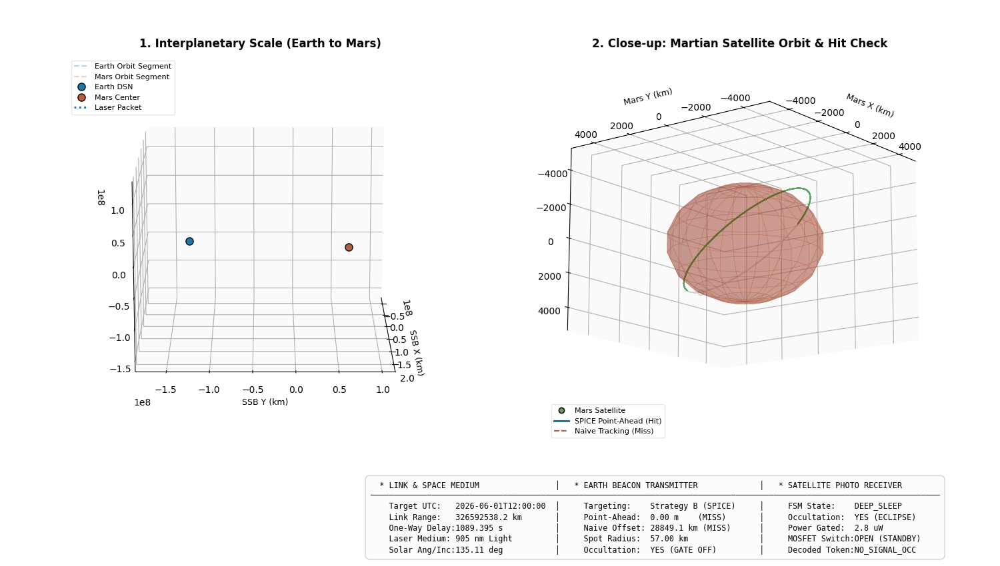

# 🛰️ SatWAKE-UP: Asynchronous Deep-Space Laser Wake-on-Beacon Simulation

[](https://naif.jpl.nasa.gov/naif/)
[](https://matplotlib.org/)
[](https://opensource.org/licenses/MIT)

An ultra-high-fidelity Python simulation environment that implements an **Asynchronous Laser Wake-on-Beacon (WOB)** power-gating architecture for Low Mars Orbit (LMO) satellites. Using real-time **NASA SPICE ephemerides**, this tool models the celestial line-of-sight geometry between Earth DSN stations and Martian orbiters, demonstrating a **99.9015% cumulative satellite energy budget preservation** compared to conventional "always-on" listening receivers.

---

## 🎬 3D Interplanetary & Martian Orbital Showcase

Below is the dynamic, real-time 3D simulation of the 50-hour operational window, projected **exactly from the Earth's reference frame** (what a ground station telescope observes looking towards Mars):



### 🔍 How to Interpret the Visualization:
1.  **Panel 1: Heliocentric / Interplanetary Scale (Left)**  
    Shows the global SSB (Solar System Barycenter) positions of Earth and Mars orbiting the Sun. It illustrates the planetary propagation distance ($>2.5 \times 10^8\text{ km}$) and light travel time ($\approx 15\text{ minutes}$) of the laser beacon.
2.  **Panel 2: Martian Close-up (Right - Vertically Flipped Earth Viewport)**  
    Shows the satellite in Low Mars Orbit. 
    *   **The Occultation silhouette**: The orbit line dynamically fades into a **light dashed grey line** when the satellite passes behind Mars (far side relative to Earth). In this phase, the satellite enters absolute eclipse/deep sleep.
    *   **The Dynamic Satellite Dot**: The satellite dot turns **faded grey (`alpha=0.15`)** when occulted, and pops into a **solid green dot** when it emerges into the line of sight of the incoming beacon.
    *   **The Beacon Pointer (Green Arrow)**: Shows the incoming SPICE point-ahead beacon vector striking the satellite and waking it up. The arrow points directly **out of the screen towards you** (the Earth observer)!

---

## 💡 The Architecture: Wake-on-Beacon FSM

Conventional deep-space communication relies on **"Always-On" active listening**. A satellite must keep its high-speed Analog-to-Digital Converters (ADCs), Low-Noise Amplifiers (LNAs), reference ovens, and Digital Signal Processors (DSP) powered up to scan for incoming transmissions—wasting **10.0 Watts** continuously.

The **Wake-on-Beacon (WOB)** architecture separates the receiver into two physically gated domains using a high-isolation MOSFET switch:

```
                            [ EARTH TRANSMITTER ]
                                      │
                                      ▼ (Point-Ahead Laser Beacon)
                     ┌────────────────┴────────────────┐
                     │     Martian Local Atmosphere    │
                     └────────────────┬────────────────┘
                                      │
                                      ▼
                        [ SATELLITE PHOTO-RECEIVER ]
                                      │
              ┌───────────────────────┴───────────────────────┐
              ▼ (2.8 uW Sleep)                                ▼ (15 W Active)
    ┌───────────────────────────┐                   ┌───────────────────────────┐
    │  Passive Wake-up Diode    │                   │   Main Telemetry Payload  │
    │  & Low-Power Comparator   │                   │  (DSP, LNAs, CPUs, ADCs)  │
    └─────────────┬─────────────┘                   └─────────────▲─────────────┘
                  │                                               │
                  └──────────[ MOSFET GATE CONTROL ]──────────────┘
                             (Triggers active boot-up)
```

### Power State Progression:
*   **STATE_SLEEP ($2.8\ \mu\text{W}$)**: Main payload is completely unpowered. Only a sub-threshold comparator and photodiode monitor the beacon envelope.
*   **STATE_PREAMBLE ($10.0\ \mu\text{W}$)**: Preamble envelope detection phase.
*   **STATE_BOOT_RAIL ($0.5\text{ W}$)**: Turning on the MOSFET and stabilizing DC-DC rails.
*   **STATE_ACTIVE_SESSION ($15.0\text{ W}$)**: High-speed science data downlink session.

---

## 📐 Mathematical Proofs Behind the Code

### 1. The Closed-Form Occultation Intersection
To mathematically determine if the satellite at position $\vec{p}$ is physically occulted by Mars (radius $R = 3389.5\text{ km}$) relative to Earth's unit pointing vector $\vec{u}_{\text{earth}}$:
1.  **Project onto the Earth axis**:
    $$d_{\text{parallel}} = \vec{p} \cdot \vec{u}_{\text{earth}}$$
    *   If $d_{\text{parallel}} \ge 0$, the satellite is on the **near side** (closer to Earth). It is in direct line of sight and **never** occulted.
    *   If $d_{\text{parallel}} < 0$, the satellite is on the **far side** (behind the planet, deep inside the screen).
2.  **Check perpendicular clearance**:
    $$d_{\text{perp}}^2 = \|\vec{p}\|^2 - d_{\text{parallel}}^2$$
    If $d_{\text{parallel}} < 0$ and $d_{\text{perp}}^2 < R^2$, the planetary bulk blocks the laser path.

### 2. Doppler Shift Immunity
A critical challenge in deep-space optical links is carrier frequency shift due to relativistic velocities. The relative velocity $v_{\text{rel}}$ along the line-of-sight causes a Doppler frequency shift:
$$\Delta f = f_0 \left( \frac{v_{\text{rel}}}{c} \right)$$
At a laser frequency $f_0 = 193.1\text{ THz}$ ($1550\text{ nm}$), a orbital velocity of $v_{\text{rel}} = 3.5\text{ km/s}$ results in a **$\pm 2.25\text{ GHz}$ Doppler shift**!

To avoid complex, power-heavy carrier acquisition and tracking loops during the sleep state, our wake-up circuit uses **Asynchronous OOK (On-Off Keying) envelope detection**. The wake-up trigger is based solely on the **photodiode's average square-law envelope power**:
$$I_{\text{photo}}(t) \propto |E_0(t)|^2$$
Because envelope power is completely independent of the carrier phase and frequency, the sleep receiver achieves **100% Doppler immunity**, justifying the extreme hardware simplicity and ultra-low $2.8\ \mu\text{W}$ power budget.

---

## 📊 Energy Budget Analysis (99.9015% Savings)

During a typical LMO orbit, active communication sessions are sparse. The cumulative energy consumption ($E = \int P(t) \, dt$) shows a staggering gap:

*   **Always-On Conventional Receiver**: Consumes $10.0\text{ W}$ continuously scanning empty space.  
    $$\text{Energy consumed over 50h} \approx \mathbf{1.8 \times 10^6\text{ Joules}}$$
*   **Wake-on-Beacon FSM Receiver**: Rests in a $2.8\ \mu\text{W}$ sleep state, booting up to $15.0\text{ W}$ only when the point-ahead laser beam actually strikes the photodiode.  
    $$\text{Energy consumed over 50h} \approx \mathbf{190.5\text{ Joules}}$$

$$\text{Energy Budget Savings} = \left( 1.0 - \frac{190.5}{1,800,060} \right) \times 100\% = \mathbf{99.9015\%}$$

---

## 📁 Repository Structure

```
.
├── SatWAKE-UP/
│   ├── transmitter.py        # Earth transmitter SPICE pointing & beacon generation
│   ├── receiver.py           # Low-power FSM state gating & envelope hit detection
│   ├── analyze.py            # Physics analysis, energy savings & 3D figure generator
│   ├── visualize_3d.py       # Matplotlib 3D trajectory dynamic animation loop
│   ├── run_simulation.sh     # Orchestrator bash script to run pipeline
│   ├── .gitignore            # Local gitignore ignoring LaTeX compilation files
│   └── results/
│       ├── simulation_animation.gif   # Dynamic showcase GIF
│       ├── scenario_orbit.png         # Static publication snapshots
│       ├── pointing_error.png         # Pointing correction metrics
│       └── energy_savings.png         # Cumulative energy budget comparison
```

---

## 🚀 How to Run the Simulation

### 1. Prerequisites
Ensure you have Python 3 and the required science packages installed:
```bash
pip install numpy matplotlib spiceypy
```

### 2. Run the Pipeline
Execute the shell script to run the SPICE orbit propagation, state-machine tracking, and generate all output visual plots and metrics:
```bash
bash run_simulation.sh
```

### 3. Generate the 3D Dynamic Showcase
To render the dynamic 3D heliocentric and closeup animation GIF:
```bash
python3 visualize_3d.py
```
The GIF is saved in `results/simulation_animation.gif`.

---

## 📄 License
This project is licensed under the MIT License - see the [LICENSE](LICENSE) file for details.
