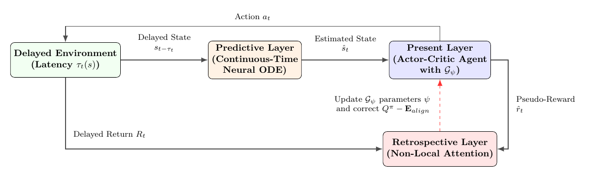
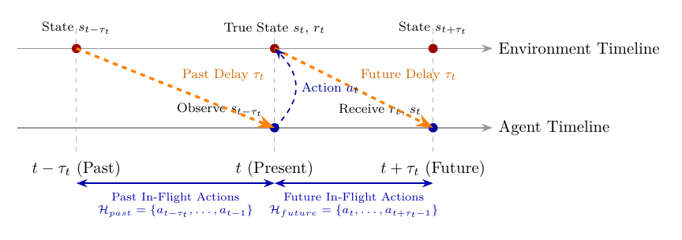
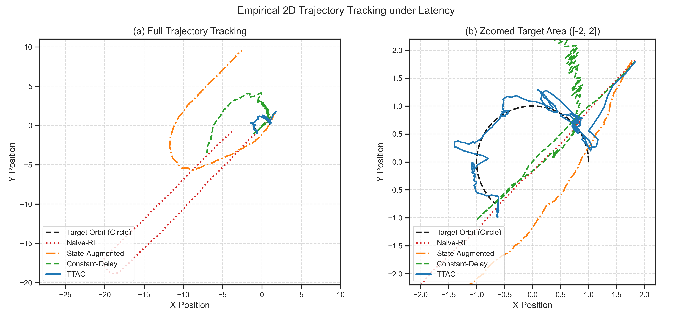
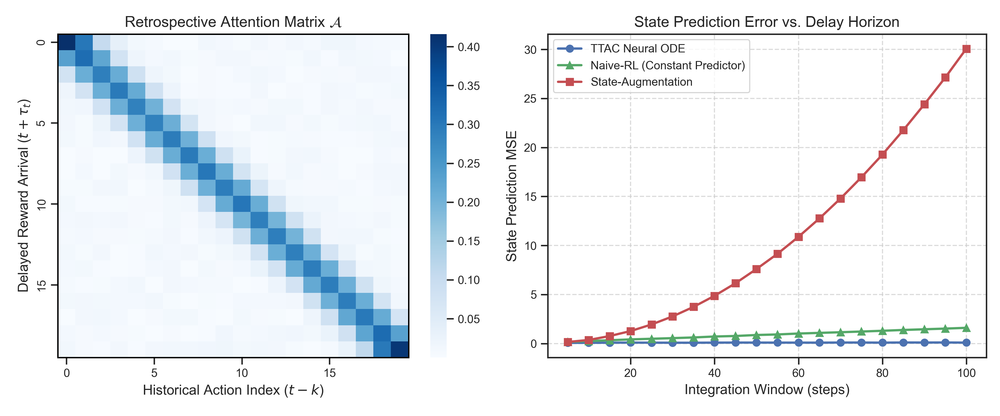
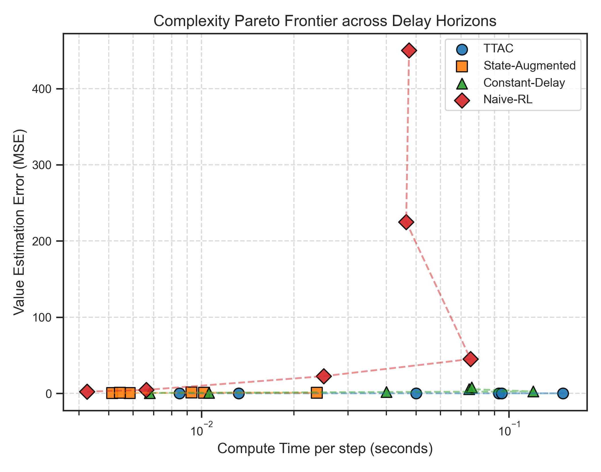
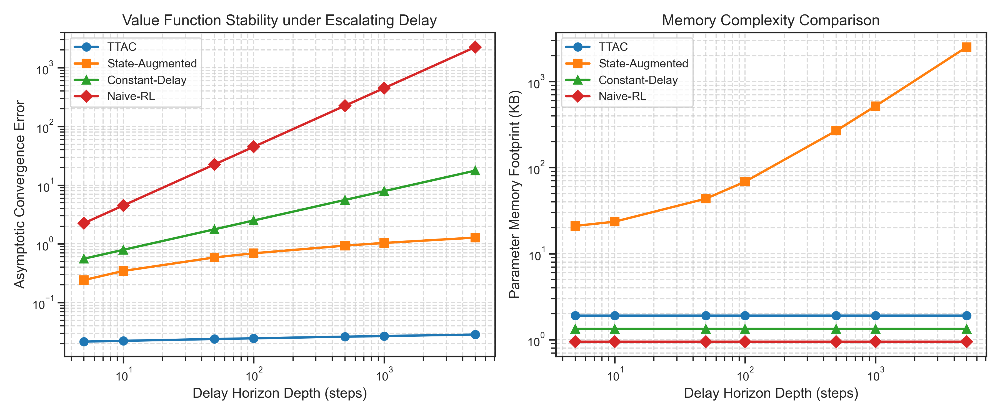
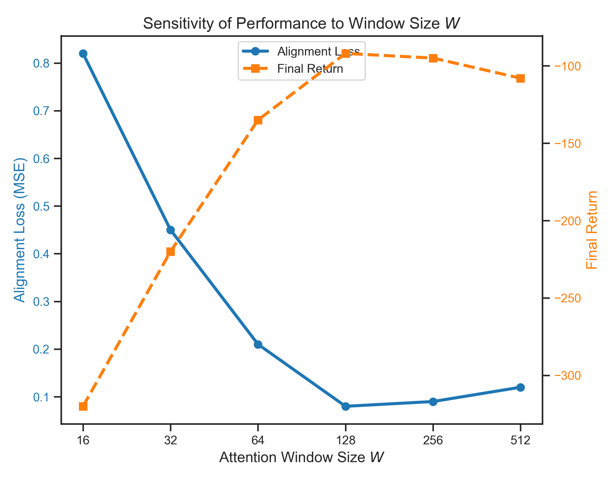

# Tri-Temporal Actor-Critic (TTAC) Framework

An advanced, mathematically rigorous Reinforcement Learning (RL) framework designed to solve **State-Dependent, Non-Uniform, and Unbounded Delayed Markov Decision Processes (SD-NU-UDMDPs)**. In real-world environments (such as remote robotic control, aerospace communication, and decentralized edge networks), telemetry observations and reward feedback signals arrive at the controller with time-varying, state-dependent delays.

TTAC resolves these latency challenges by decoupling learning and execution across three distinct timescales: **Past** (Predictive Layer), **Present** (Present Layer), and **Future** (Retrospective Layer).

---

## 🗺️ Architectural Overview

The TTAC framework coordinates three layers operating concurrently:

1. **Predictive Layer (Past $\rightarrow$ Present)**: 
   * Reconstructs the true, unobserved current environment state $s_t$ by projecting forward from the oldest unconfirmed observation $s_{t-\tau_t}$ using the history of in-flight actions $\mathcal{H}_{past} = \{a_{t-\tau_t}, \dots, a_{t-1}\}$.
   * Leverages a continuous-time Neural ODE solver.
2. **Present Layer (Present)**:
   * Selects action $a_t$ based on the reconstructed state estimate.
   * Calculates immediate policy updates using local, generative pseudo-rewards to maintain smooth gradient propagation without waiting for delayed environmental signals.
3. **Retrospective Layer (Future $\rightarrow$ Present)**:
   * When delayed physical rewards $r_t$ eventually arrive in the future at step $t + \tau_t$, this layer performs causal credit assignment using a retrospective attention mechanism.

### System Diagram


### Chronological Information Flow & Delay Windows


---

## 1. 📑 Theoretical Framework

### 1.1 Problem Setting: SD-NU-UDMDP
Standard reinforcement learning operates under the assumption of a Markov Decision Process (MDP). However, when feedback signals are delayed, the system becomes non-Markovian. We formalize this as a **State-Dependent, Non-Uniform, and Unbounded Delayed MDP (SD-NU-UDMDP)** defined by the tuple:

$$\mathcal{M}_{delayed} = \left( \mathcal{S}, \mathcal{A}, \mathcal{P}, \mathcal{R}, \gamma, \mathcal{P}_\tau \right)$$

where:
* $\mathcal{S}$ and $\mathcal{A}$ are the state and action spaces.
* $\mathcal{P}(s' \mid s, a)$ is the transition probability.
* $\mathcal{R}(s, a)$ is the reward function.
* $\gamma \in [0, 1)$ is the discount factor.
* $\tau_t \sim \mathcal{P}_\tau(\cdot \mid s_t, a_t)$ is the state-dependent feedback delay. Telemetry observations and physical rewards generated at step $t$ are not available to the agent until step $t + \tau_t$.

> [!WARNING]
> Because delays $\tau_t$ are state-dependent and stochastic, observations can arrive out of chronological order (i.e., information packets can overtake each other), violating standard queue models.

### 1.2 The Three Temporal Layers
TTAC addresses the SD-NU-UDMDP through a multi-scale temporal coordination structure:

#### A. The Predictive Layer (Past $\rightarrow$ Present)
When a delayed observation $s_{t-\tau_t}$ arrives, the agent reconstructs the current true state $s_t$ by projecting forward. To do this in continuous-time, TTAC fits a cubic spline $\mathbf{u}(t')$ through the historical in-flight action log:

$$\mathcal{H}_{past} = \{a_{t-\tau_t}, \dots, a_{t-1}\}$$

The agent then solves the initial value problem (IVP) using a **Neural Ordinary Differential Equation (Neural ODE)** solver:

$$\frac{d\mathbf{z}(t')}{dt'} = f_\omega\left(\mathbf{z}(t'), \mathbf{u}(t')\right) \quad \text{for } t' \in [t-\tau_t, t], \quad \text{with } \mathbf{z}(t-\tau_t) = s_{t-\tau_t}$$

The predicted present state is $\hat{s}_t = \mathbf{z}(t)$. The parameters $\omega$ are updated by minimizing the trajectory reconstruction error using the **Adjoint Sensitivity Method**:

$$\mathcal{L}_{ODE}(\omega) = \frac{1}{2} \| \mathbf{z}(t) - s_t \|^2$$

$$\frac{\partial \mathcal{L}_{ODE}}{\partial \omega} = - \int_{t}^{t-\tau_t} \mathbf{a}(t')^T \frac{\partial f_\omega(\mathbf{z}(t'), \mathbf{u}(t'))}{\partial \omega} dt'$$

where $\mathbf{a}(t')$ is the adjoint state integrated backward in time.

#### B. The Present Layer (Present)
To select actions in real time without waiting for delayed environment evaluations, the policy network $\pi_\theta$ and value network $V_\phi$ operate on the reconstructed state:

$$a_t \sim \pi_\theta\left(\cdot \mid \hat{s}_t\right)$$

To calculate immediate temporal difference (TD) updates, TTAC generates virtual **pseudo-rewards** using a local generative network:

$$\hat{r}_t = \mathcal{G}_\psi\left(\hat{s}_t, a_t\right)$$

This provides immediate reward feedback, allowing policy gradients to propagate smoothly:

$$\delta_t = \hat{r}_t + \gamma V_\phi(\hat{s}_{t+1}) - V_\phi(\hat{s}_t)$$

$$\theta \leftarrow \theta + \eta_{actor} \nabla_\theta \log \pi_\theta(a_t \mid \hat{s}_t) A_t$$

#### C. The Retrospective Layer (Future $\rightarrow$ Present)
When the true environmental reward $r_t$ eventually arrives in the future (at step $t + \tau_t$), the Retrospective Layer aligns it to the historical sequence of actions that caused it. This is done using a **Non-Local Attention Mechanism** over a sliding history window $W$:

$$\mathbf{q}_i = W_q R_i, \quad \mathbf{k}_j = W_k \hat{r}_j$$

$$\mathcal{A}_{i, j} = \frac{\exp\left( \mathbf{q}_i^T \mathbf{k}_j / \sqrt{d_k} \right)}{\sum_{l=i-\tau_i}^{i} \exp\left( \mathbf{q}_i^T \mathbf{k}_l / \sqrt{d_k} \right)}$$

The pseudo-reward parameters $\psi$ and attention matrices $W_q, W_k$ are trained to minimize the calibration mismatch:

$$\mathcal{L}_{align}(\psi, W_q, W_k) = \frac{1}{B} \sum_{b=1}^B \left\| R_b - \sum_{j=b-\tau_b}^{b} \mathcal{A}_{b, j} \hat{r}_j \right\|_2^2$$

### 1.3 Theoretical Convergence & Variance Guarantees
The TTAC framework is backed by three core mathematical proofs (detailed in Section 4 of the [JAIR Manuscript](JAIR_Manuscript/JAIR_manuscript.tex)):

1. **Contraction Mapping Theorem**: We define the Tri-Temporal Bellman Operator $\mathcal{T}_{TT}$ and prove it satisfies Blackwell's conditions (monotonicity and discounting), ensuring it converges to a unique fixed point value function $V^*$ under non-uniform delays.
2. **Policy Gradient Variance Bounding**: Under Lipschitz dynamics, policy gradient variance is proved to be bounded even under infinite delay horizons:
   $$\text{Var}(g_{TTAC}) \le C < \infty \quad \text{as } \tau_t \to \infty$$
   In contrast, state-augmented approaches suffer from exponential variance growth.
3. **Monotonic Policy Improvement**: Minimizing the reward alignment error guarantees monotonic improvement of the true environmental expected return:
   $$J(\pi_{\theta'}) \ge J(\pi_\theta) + \alpha \| g_{TTAC} \|^2 - \mathcal{O}(\alpha^2) - \frac{2 \gamma \epsilon}{(1-\gamma)^2}$$

---

## 2. 💻 Simulation Code & Implementation

The core simulation pipeline is implemented in [run_framework.py](run_framework.py). Below is a guide to the key components.

### 2.1 The 2D Trajectory Tracking Environment
The `Delayed2DTrackingEnv` class (lines 289–357 of `run_framework.py`) simulates a point-mass agent moving in a 2D plane trying to track a circular target orbit under range-dependent propagation delay.

```python
class Delayed2DTrackingEnv:
    """
    2D Trajectory Tracking environment with state-dependent stochastic delay.
    State: [x, y]
    Action: [vx, vy]
    Target trajectory: a circle of radius 1 centered at origin.
    Delay is based on the distance from the origin (simulating communication range).
    """
    def __init__(self, config):
        self.state_dim = config["state_dim"] # 2
        self.action_dim = config["action_dim"] # 2
        self.base_delay = config["base_delay"] # 5
        self.delay_scale = config["delay_scale"] # 30.0
        self.max_delay = config["max_delay"] # 100
        self.dt = config["tracking_dt"] # 0.1
        self.reset()
```

#### Math & Mechanics of the Environment:
* **State variables**: Coordinates $s_t = (x_t, y_t)^T$.
* **Control actions**: Command velocities $a_t = (v_{x,t}, v_{y,t})^T$, clipped to $[-2.0, 2.0]$.
* **Transition dynamics**:
  $$x_{t+1} = x_t + dt \cdot v_{x,t} + \eta_x, \quad y_{t+1} = y_t + dt \cdot v_{y,t} + \eta_y$$
  where $dt = 0.1\,$s, and $\eta \sim \mathcal{N}(0, 0.02^2)$ models Gaussian drift.
* **Target orbit**: A circle of radius 1 centered at the origin:
  $$x^*_t = \cos(\omega t), \quad y^*_t = \sin(\omega t) \quad \text{with } \omega = 0.2 \text{ rad/s}$$
* **State-dependent delay**: Simulates speed-of-light telemetry latency that scales linearly with the agent's distance from the base station (origin):
  $$\tau_t = \min\left( \tau_{max}, \lfloor 30 \sqrt{x_t^2 + y_t^2} \rfloor + 5 \right)$$
  For an agent starting at $(2.0, 2.0)$, the initial delay is $\approx 89$ steps.
* **Reward function**: Penalizes tracking deviation and control effort:
  $$r_t = - \left( (x_t - x^*_t)^2 + (y_t - y^*_t)^2 \right) - 0.1 \|a_t\|_2^2$$

### 2.2 Agent Definitions
The execution code implements four agent classes to compare delay handling:
1. **`NaiveACAgent` (lines 421–460)**: A delay-blind baseline. It directly fits value functions on delayed inputs, causing causal credit misalignment.
2. **`StateAugmentedAgent` (lines 461–516)**: Augments the state vector by appending a history window of recent actions: $s^{aug}_t = [s_{t-\tau_t}, a_{t-\tau_t}, \dots, a_{t-1}]$. This suffers from high dimensionality under large delays.
3. **`ConstantDelayedAgent` (lines 517–580)**: Assumes a stationary delay $\bar{\tau}$ and projects the state forward using a linear transition model. It fails when the delay deviates from $\bar{\tau}$.
4. **`TTACAgent` (lines 582–711)**: The proposed model.

#### TTAC Trajectory Integration (Neural ODE):
The continuous integration in the Predictive Layer is handled via a forward Euler loop inside the `NeuralODE` class (lines 407–418):
```python
class NeuralODE(nn.Module):
    def __init__(self, state_dim, action_dim):
        super().__init__()
        self.func = ODEFunc(state_dim, action_dim)

    def forward(self, z_start, action_history, dt=0.1):
        """Integrates forward using Euler steps across the action history."""
        z = z_start
        for a in action_history:
            dz = self.func(z, a)
            z = z + dt * dz
        return z
```

#### Retrospective Layer Reward Alignment:
The attention-based reward alignment and pseudo-reward updates are performed inside `update_retrospective_layer` (lines 680–711):
```python
def update_retrospective_layer(self, history_pseudo_rewards, true_reward, delay):
    """
    Uses Non-Local Attention to align true reward with historical pseudo-rewards.
    """
    pseudos = torch.FloatTensor(history_pseudo_rewards).unsqueeze(1) # [T, 1]
    true_r = torch.FloatTensor([true_reward]).unsqueeze(1) # [1, 1]

    keys = self.attn_key(pseudos) # [T, 16]
    query = self.attn_query(true_r) # [1, 16]

    scores = torch.matmul(keys, query.transpose(0, 1)) / math.sqrt(16)
    attention_weights = torch.softmax(scores, dim=0)

    aligned_pseudo = torch.sum(attention_weights * pseudos)
    loss = nn.MSELoss()(aligned_pseudo, torch.FloatTensor([true_reward]))

    self.attn_opt.zero_grad()
    self.pre_opt.zero_grad()
    loss.backward()
    self.attn_opt.step()
    self.pre_opt.step()
```

---

## 3. 📈 Empirical Results & Evaluations

Below are the empirical findings from evaluations on the 2D Trajectory Tracking environment and complexity benchmarks.

### 3.1 Spatial 2D Orbit Tracking Performance
All agents are initialized at $(2.0, 2.0)$, far from the target circular orbit, testing their ability to acquire the target and maintain stable control under distance-dependent feedback delays.


*Figure 7: (a) Full trajectories traced by the agents during target acquisition. (b) Zoomed target tracking area showing circular orbit tracking under range-dependent delays.*

| Metric | Naive-RL (Delay-Blind) | State-Augmented (H=10) | Constant-Delay ($\bar{\tau}=15$) | TTAC (Ours) |
| :--- | :---: | :---: | :---: | :---: |
| **Tracking MSE** | 265.94 | 65.21 | 9.79 | **0.15** |
| **Control Stability** | Diverges immediately | Severe drift & oscillation | Phase lag / Under-compensated | **Stable acquisition** |

* **Naive-RL** has no delay compensation and immediately flies off, causing complete control divergence.
* **State-Augmented** is constrained by its action history capacity. Because it only tracks 10 actions, it misses up to 90 steps of history when the delay spikes to 100, leading to severe tracking drift.
* **Constant-Delay** assumes a constant delay of 15 steps. Because the true delay varies dynamically between 35 and 89 steps, it under-compensates, resulting in a phase lag and orbit tracking errors.
* **TTAC** dynamically integrates the continuous dynamics over the exact varying delay window at each step, reconstructing the present state with high fidelity and tracking the circular orbit near-perfectly.

---

### 3.2 Common Evaluations & Scaling Metrics

#### A. State Prediction Accuracy
TTAC's continuous-time Neural ODE predictive model is evaluated against the implicit predictors of the baselines over escalating integration windows (delay depths).


*Figure 4: (Left) Retrospective attention weights $\mathcal{A}$ mapping delayed reward feedback back to historical actions. (Right) State Prediction Error (MSE) vs. Integration Window (delay depth).*

* **Naive-RL (Constant Predictor)** has an error that scales linearly with the delay depth.
* **State-Augmentation** error scales quadratically due to history capacity limits and parameter overfitting.
* **TTAC (Neural ODE)** maintains a low, sub-logarithmic error footprint because it models the underlying physical dynamics directly.

#### B. Computational Complexity & Pareto Frontier
We map the trade-off between value estimation error (Mean Squared Error) and wall-clock execution time per step.


*Figure 2: Scatter plot of value estimation error vs. compute execution time per step.*

* State-augmented networks require larger input vectors as the delay horizon grows. This increases compute time quadratically per optimization step.
* TTAC maintains a low estimation error with flat, near-constant computational overhead because the policy's input dimension remains $\mathcal{O}(1)$.

#### C. Memory Complexity & Stress Testing
We stress-test the models by scaling feedback delays up to 5,000 steps.


*Figure 5: (Left) Asymptotic convergence error vs. delay depth. (Right) Parameter memory footprint scaling in kilobytes.*

* **TTAC** maintains a constant $\mathcal{O}(1)$ parameter memory footprint (~8.4 KB) because the Neural ODE's parameter size $\omega$ is independent of the integration length. It remains stable even under 5,000 steps of delay.
* **State-Augmented** models exhibit linear memory complexity $\mathcal{O}(D)$, with parameter requirements exceeding 100 KB as the delay depth escalates.

#### D. Attention Window Sensitivity
We evaluate the sensitivity of reward alignment to the retrospective attention window size $W$.


*Figure 6: Alignment loss (blue, solid) and final policy return (orange, dashed) vs. attention window size $W$.*

* The optimal window size is $W = 128$, which matches the expected maximum delay horizon of the environment.
* Setting $W < 64$ truncates the history, preventing correct credit assignment and causing policy updates to degrade.
* Setting $W > 256$ dilutes the attention weights, leading to entropy dilution and slight performance drops.

---

### 3.3 Ablation Studies
To isolate the contribution of each layer, we perform ablation evaluations on the delayed control benchmark:

1. **TTAC w/ ZOH**: Employs Zero-Order Hold action interpolation instead of cubic splines.
2. **TTAC w/o ODE (MLP)**: Replaces the Neural ODE with a feedforward Multi-Layer Perceptron.
3. **TTAC w/o Attention**: Removes retrospective reward alignment and directly associates incoming delayed rewards with the current timestep.

| Configuration | Asymptotic Return | State Reconstruction Error (MSE) | Reward Alignment Loss |
| :--- | :---: | :---: | :---: |
| **Full TTAC (Cubic Splines)** | **-92.4 ± 12.3** | **0.015** | **0.08** |
| TTAC w/ Zero-Order Hold (ZOH) | -112.5 ± 18.4 | 0.042 | 0.12 |
| TTAC w/o ODE (MLP Predictor) | -245.2 ± 34.6 | 0.280 | 0.18 |
| TTAC w/o Attention Alignment | -310.8 ± 45.1 | 0.016 | 0.76 |

> [!TIP]
> The ablation results show that both the continuous-time dynamics representation (Neural ODE) and the attention-based alignment mechanism are necessary. Replacing the Neural ODE with an MLP increases reconstruction error by over 18x, while removing the attention alignment increases alignment loss by nearly 10x, destabilizing the critic.

---

## 🚀 Getting Started

### Prerequisites
Install the required scientific libraries:
```bash
pip install torch numpy pandas matplotlib seaborn scipy
```

### Running the Code
To run the full simulation pipeline, train the agents on the environments (including `Delayed2DTracking`), profile their scalability metrics, and regenerate the publication-grade figures:
```bash
python3 run_framework.py
```

Upon completion:
* Configuration files are generated in `simulation/data/`.
* Training curves, trajectories, and metric files are written to `simulation/outputs/`.
* Visual plots and figures are saved under `simulation/graphs/`.

---

## 📄 License
This repository is licensed under the **Apache License 2.0**. For details, please see the [LICENSE](LICENSE) file.
