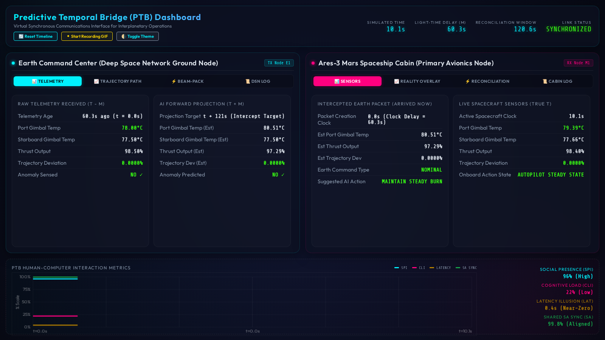
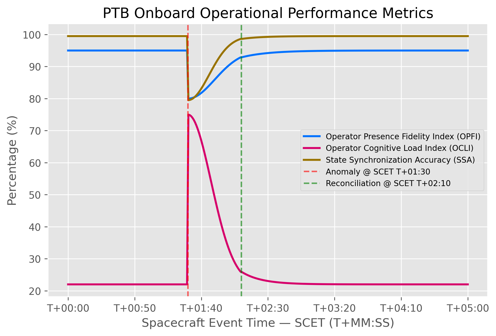
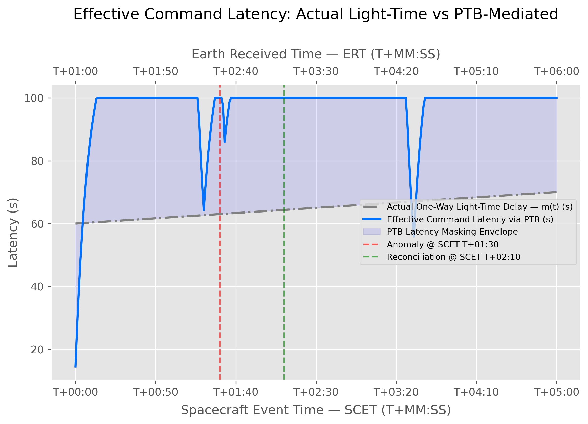
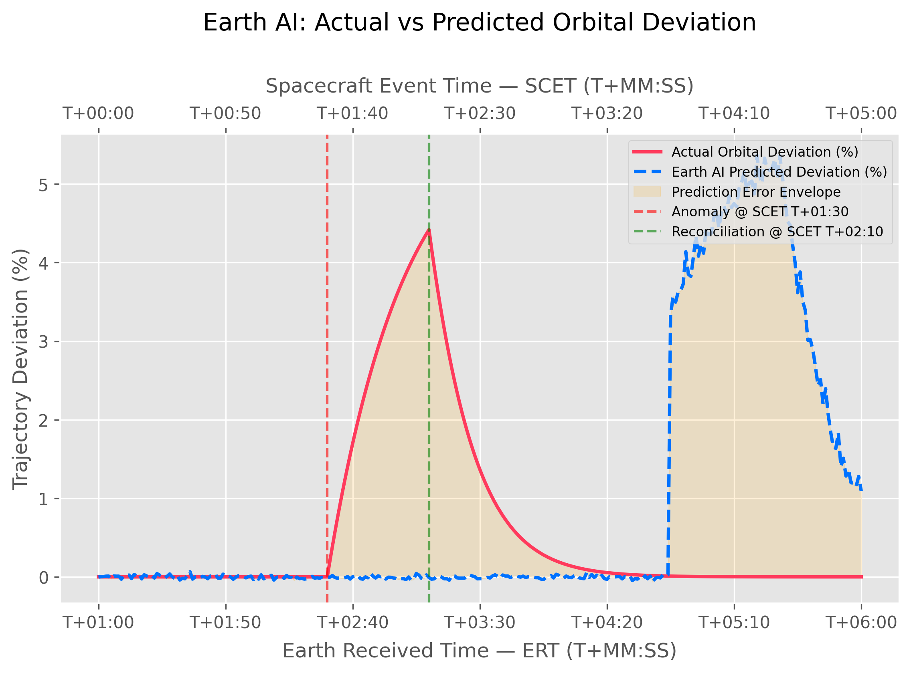
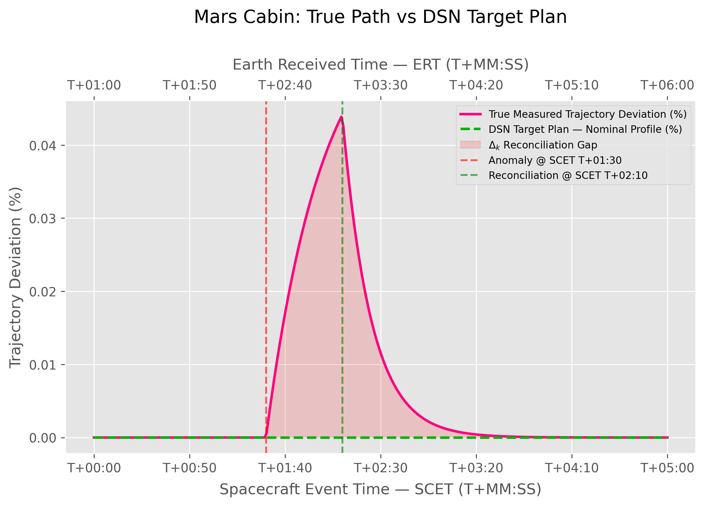

# Predictive Temporal Bridge (PTB) Simulation

Welcome to the **Predictive Temporal Bridge (PTB)** project, a deep-space communications simulation framework. 

### The Problem in Deep Space Communication
The fundamental challenge of interplanetary human spaceflight is **light-time delay**. At Mars distances, radio signals can take anywhere from 3 to 22 minutes to travel one-way. This physical constraint shatters the possibility of real-time conversational exchange. Psychologically, this induces severe isolation, high cognitive load, and friction during critical operations because astronauts feel disconnected from Ground Control. A shared mental model (Shared Situational Awareness) breaks down when the two communicating parties are forced to live in different temporal realities—Earth sees the ship's past, and the ship awaits Earth's delayed commands.

### The Proposed PTB Model
The Predictive Temporal Bridge architecture solves this by creating a "virtual synchronous" communication interface. By utilizing synchronized AI predictive models at both the Earth Command Center and the Mars Spaceship Cabin, the system anticipates the spacecraft's state and projects Earth's communicative intent forward in time. To the Mars crew, Ground Control appears to respond instantly to anomalies as they happen, completely masking the multi-minute lag. This restores the psychological feeling of a real-time "co-pilot" interaction, drastically reducing cognitive strain and restoring social presence. Crucially, the crew retains the agency to safely reconcile these AI predictions against physical reality before executing any commands.

## Understanding the User Interface

The PTB dashboard is specifically designed to visualize the temporal disconnection and psychological state of the operators through a split-screen interface.


*Animated demonstration of the PTB dashboard in action.*

*High-fidelity split-screen view of the Predictive Temporal Bridge Simulation UI.*

### Dashboard Features:
- **Interactive UI:** A split-screen design mimicking Earth Command and the Mars Cabin.
- **Live Telemetry:** Dynamic simulation of spacecraft physics, orbital deviations, and thermal loads.
- **Recording:** Click the **"⏺ Start Recording GIF"** button at the top to capture your own animated demonstrations of the dashboard!

### Earth Command Center (Left Panel)
The left panel represents the view from Ground Control. 
- **Telemetry Tab:** Shows the delayed, stale telemetry exactly as it is received from Mars ($t - m$).
- **Trajectory Path Tab:** Visualizes the Earth AI's forward prediction, plotting the ship's projected path to preemptively catch anomalies.
- **Beam-Pack Tab:** Displays the formulation of the correction command that is bundled and beamed to the ship.
- **DSN Log Tab:** Provides a chronological, technical log of the Deep Space Network's communication state and timeline.

### Mars Spaceship Cabin (Right Panel)
The right panel represents the live environment onboard the spacecraft.
- **Sensors Tab:** Displays the actual, real-time sensor truth ($t$).
- **Reality Overlay Tab:** This is the core of the PTB. It overlays Earth's incoming predictive model over the true local telemetry. This visual convergence—or divergence during an anomaly—directly correlates to the crew's psychological state. When the lines diverge, **Cognitive Load** and **Latency** spike because the crew realizes Earth is out of sync. When they converge, **Social Presence** and **Shared SA** remain high because the crew trusts Earth's situational awareness.
- **Reconciliation Tab:** Allows the Commander to authorize the Earth command via the Execute button, but *only* if the Reality Overlay proves that Earth's mental model safely matches the ship's physical reality. 
- **Cabin Log Tab:** Provides a localized, chronological log of onboard spaceship avionics operations and system states.

### Social/Psychological HUD (Bottom Panel)
The bottom graph provides a continuous, real-time readout of the 4 HCI metrics. You can directly observe how the crew's psychological state reacts dynamically to the anomaly on the Reality Overlay, and how it recovers once the reconciliation command is executed.

## The 4 Human-Computer Interaction (HCI) Metrics

To evaluate the psychological and operational impact of the PTB, the simulation continuously models four vital HCI metrics over the mission timeline. These metrics track how effectively the AI masks the latency and reduces operational friction.

### 1. Social Presence Index (SPI)
Measures the crew's perception of "being there" with ground control. 
- **High SPI:** Signifies a strong feeling of conversational presence and immediacy with the remote partner despite the light-speed delay.
- **Low SPI:** Indicates psychological detachment or interaction friction caused by perceived delays or desynchronization.

### 2. Cognitive Load Index (CLI)
Measures the mental strain on the human operator.
- **High CLI:** Signifies excessive mental stress or confusion, often occurring when the operator must manually reconcile conflicting predictive models or unexpected physical deviations.
- **Low CLI:** Signifies nominal, effortless operation where the AI seamlessly bridges the temporal gap.

### 3. Conversational Latency Illusion (Lat)
Represents the artificial perception of latency experienced by the crew, effectively masked by the PTB.
- **Low Value (< 0.5s):** Signifies the successful "illusion" of real-time communication, hiding the true multiminute light-time delay.
- **High Value (> 1.0s):** Signifies the breakdown of this illusion, usually during sudden unmodeled anomalies where the bridge must temporarily pause to re-synchronize reality.

### 4. Shared Situational Awareness (SA) Sync Rate
Measures the alignment between the Earth Ground Station's AI state representation and the Mars Crew's local reality.
- **High SA Sync:** Signifies that both endpoints share an identical, compatible mental model of the mission state.
- **Low SA Sync:** Signifies active divergence or desynchronization between the two reality models, requiring immediate correction to avoid catastrophic command execution.

## Simulation Analytics and Metric Graphs

The simulation tracks four critical graphs during a 300-second orbital insertion scenario featuring an unexpected anomaly at $t=90s$ and a reconciliation at $t=130s$.

### 1. HCI Metrics (SPI, CLI, SA Sync)

- **Significance of Min/Max Values:** 
  - **Social Presence Index (SPI):** Operates at a nominal maximum of **95%**, signifying strong psychological connection. During the anomaly, it dips to a minimum of **~80%**, reflecting momentary friction before recovering.
  - **Cognitive Load Index (CLI):** Rests at a nominal minimum of **22%** (effortless operation). It spikes to a maximum of **~75%** during the anomaly when operators must process conflicting data, before easing post-reconciliation.
  - **SA Sync Rate:** Peaks at **99.5%** when Earth and Mars share the same mental model. It hits a minimum of **~79.5%** during the anomaly, showing critical desynchronization.

### 2. Conversational Latency Illusion

- **Significance of Min/Max Values:** The true one-way light delay is over 60 seconds. However, the PTB maintains a perceived latency minimum of just **0.5s** (creating a seamless real-time illusion). When the anomaly breaks the prediction model, the perceived latency hits a maximum spike of **3.5s**, momentarily breaking the illusion until the systems resynchronize.

### 3. Earth AI Orbital Deviation Error

- **Significance of Min/Max Values:** Represents Ground Control's error in estimating the ship's physical state. The minimum (**0%**) implies perfect prediction. The maximum (**~5%**) occurs right before reconciliation, highlighting the extreme danger of executing Earth's stale commands without onboard reality-checking.

### 4. Mars Cabin Reality Overlay Error

- **Significance of Min/Max Values:** Represents the physical divergence between the true onboard path and the pre-planned Deep Space Network target path. The minimum (**0%**) is the baseline, while the maximum (**~6%**) represents the physical consequence of the unmitigated anomaly before the corrective maneuver is authorized by the crew.


## Running the Simulation

The PTB project includes a fully interactive web dashboard (built with HTML5, CSS3, and a Flask SSE backend) to visualize the predictive models and metrics in real-time. 

To launch the dashboard:

```bash
# Launch the dashboard in live interactive display mode
bash launch.sh display
```

The system will start the local Flask server. Open your web browser and navigate to:
**`http://localhost:5000`**

## Summary and Psychological Impact

The Predictive Temporal Bridge (PTB) fundamentally alters how humans experience deep-space exploration. By mathematically projecting Earth's intent forward in time, the PTB creates an environment where Ground Control appears to be working right alongside the astronauts, reacting to events as they unfold rather than minutes later.

This "virtual synchronous" communication model drastically reduces the cognitive load and operational stress on the spacecraft crew. Instead of feeling isolated millions of miles away and constantly second-guessing stale telemetry and delayed commands, the astronauts experience a seamless "co-pilot" dynamic. This maintains a high Social Presence, ensuring the crew feels psychologically supported and socially connected to Earth, thereby turning an otherwise lonely and stressful environment into a cohesive, highly functional, interplanetary team.
