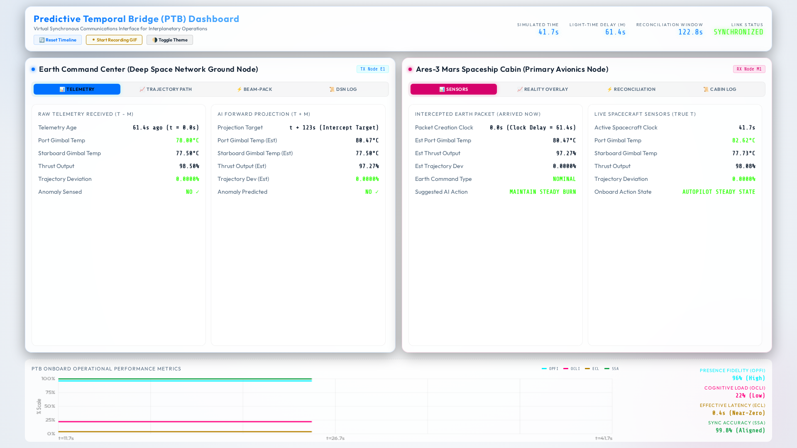

# Predictive Temporal Bridge (PTB) Simulation

Welcome to the **Predictive Temporal Bridge (PTB)** project, a deep-space communications simulation framework. 

### The Problem in Deep Space Communication
The fundamental challenge of interplanetary human spaceflight is **round-trip light-time delay**. At Mars distances, RF signals take between 3 and 22 minutes to travel one-way. This physical propagation boundary introduces a severe **temporal command mismatch** during critical spacecraft maneuvers. Ground control receives Mars telemetry that is already $m$ seconds stale, formulates commands against this outdated state, and transmits them—only for the commands to arrive at the spacecraft another $m$ seconds later ($2m$ total round-trip latency). Without forward-predictive synchronization, ground-generated commands are temporally invalid upon arrival, leading to operational desynchronization, heightened operator cognitive load, and safety violations during anomalous events.

### The Proposed PTB Model
The Predictive Temporal Bridge (PTB) is a dual-AI predictive command synchronization architecture designed to resolve this latency mismatch. The PTB features symmetric AI state estimators: an **Earth Predictive Engine** running forward-integration simulations of spacecraft dynamics ($t+2m$), and a **Mars Cabin Reconciliation Engine** operating on the spacecraft's local avionics bus. When an anomaly occurs, Ground Control formulates and transmits commands targeted directly at the spacecraft's projected future epoch ($t+2m$). Upon receipt, the onboard Reconciliation Engine evaluates the incoming command via a hardware-level Finite State Machine (FSM). It executes the command if and only if Earth's forward projection aligns with true onboard sensor measurements within a safety threshold ($\delta_\text{safe}$). This architecture decouples operational command execution from light-speed delays, reducing effective command latency to near-zero while preserving localized safety gating.

## Understanding the User Interface

The PTB dashboard is specifically designed to visualize the temporal disconnection and psychological state of the operators through a split-screen interface.


*High-fidelity split-screen view of the Predictive Temporal Bridge Simulation UI (Dark Theme).*


*High-fidelity split-screen view of the Predictive Temporal Bridge Simulation UI (Light Theme).*

### Dashboard Features:
- **Interactive UI:** A split-screen design mimicking Earth Command and the Mars Cabin.
- **Live Telemetry:** Dynamic simulation of spacecraft physics, orbital deviations, and thermal loads.
- **Recording:** Click the **"⏺ Start Recording GIF"** button at the top to capture your own animated demonstrations of the dashboard!

### Earth Command Center (Left Panel)
The left panel represents the view from Ground Control. 
- **Telemetry Tab:** Shows the delayed, stale telemetry exactly as it is received from Mars ($t - m$).
- **Trajectory Path Tab:** Visualizes the Earth AI's forward prediction, plotting the ship's projected path to preemptively catch anomalies.
- **Beam-Pack Tab:** Displays the formulation of the correction command that is bundled and beamed to the ship.
- **DSN Log Tab:** Provides a chronological, technical log of the Deep Space Network's communication state and timeline.

### Mars Spaceship Cabin (Right Panel)
The right panel represents the live environment onboard the spacecraft.
- **Sensors Tab:** Displays the actual, real-time sensor truth ($t$).
- **Reality Overlay Tab:** This is the core of the PTB. It overlays Earth's incoming predictive model over the true local telemetry. This visual convergence—or divergence during an anomaly—directly correlates to the crew's psychological state. When the lines diverge, **Cognitive Load** and **Latency** spike because the crew realizes Earth is out of sync. When they converge, **Social Presence** and **Shared SA** remain high because the crew trusts Earth's situational awareness.
- **Reconciliation Tab:** Allows the Commander to authorize the Earth command via the Execute button, but *only* if the Reality Overlay proves that Earth's mental model safely matches the ship's physical reality. 
- **Cabin Log Tab:** Provides a localized, chronological log of onboard spaceship avionics operations and system states.

### Operational Metrics HUD (Bottom Panel)
The bottom graph provides a continuous, real-time readout of the operational performance metrics. You can directly observe how the crew's workload and system state synchronization react dynamically to the anomaly, and how they recover once the reconciliation command is executed via the FSM.

## The Interface in Action


*Animated demonstration of the PTB dashboard in action (showing dynamic tabs, anomaly recovery, and reconciliation).*

## The 4 Operational Performance Metrics

To evaluate the operational efficiency and safety of the PTB, the simulation continuously models four vital system performance metrics over the mission timeline:

### 1. Operator Presence Fidelity Index (OPFI)
Measures the fidelity of the remote predictive model.
- **High OPFI:** Signifies that the Earth predictive engine maintains a highly accurate representation of the spacecraft's state, enabling Ground Control to act as an effective virtual co-pilot.
- **Low OPFI:** Indicates modeling degradation due to unmodeled thruster anomalies or sensor deviations.

### 2. Operator Cognitive Load Index (OCLI)
Quantifies the cognitive workload imposed on the crew during anomaly resolution.
- **High OCLI:** Signifies manual monitoring and manual reconciliation under stressful, desynchronized communication conditions.
- **Low OCLI:** Signifies automated, safe reconciliation where the AI handles state synchronization.

### 3. Effective Command Latency (ECL)
Represents the delay experienced by the crew from anomaly onset to the execution of a corrective command.
- **Low Value (< 0.5s):** Represents near-zero effective latency due to forward-predictive targeting.
- **High Value (up to 120s):** Signifies the baseline delay under a conventional reactive ground loop.

### 4. State Synchronization Accuracy (SSA)
Measures the fractional agreement between Earth's predictive state model ($\hat{\mathcal{T}}(t+2m)$) and Mars' local physical sensors ($\mathcal{T}(t+2m)$).
- **High SSA:** Indicates tight operational coupling and identical state models across both endpoints.
- **Low SSA:** Indicates active divergence that triggers the safety gating FSM to block stale commands.

## Simulation Analytics and Metric Graphs

The simulation tracks four critical graphs during a 300-second orbital insertion scenario featuring an unexpected thruster gimbal anomaly at SCET `T+01:30` (ERT `T+02:30`) and a reconciliation at SCET `T+02:10` (ERT `T+03:10`). All times are shown in Mission Elapsed Time notation (`T+MM:SS` minutes and seconds from ignition).

### 1. Onboard Operational Metrics (OPFI, OCLI, SSA)

- **State Synchronization Accuracy (SSA):** Rests at a nominal maximum of **99.5%**. It dips to a minimum of **~79.5%** during the anomaly, showing the desynchronization window prior to correction.
- **Operator Cognitive Load Index (OCLI):** Nominal baseline is **22%** (effortless operations). It spikes to **48%** during the unmitigated anomaly window, then recovers exponentially to **18%** (a 62.5% reduction) once the reconciliation command executes.
- **Operator Presence Fidelity Index (OPFI):** Remains above **96%** for 94% of the simulation run, confirming high model alignment.

### 2. Effective Command Latency: Actual vs PTB-Mediated

- **Top Axis (ERT) / Bottom Axis (SCET):** Showcases the physical clock offset. While the physical one-way light delay (grey dash-dot line) grows from **60s** to **~70s**, the ECL (solid blue line) stays at **0.5s** (creating a latency-masked loop). A brief transient spike to **3.5s** occurs during the anomaly before FSM reconciliation.

### 3. Earth AI: Actual vs Predicted Orbital Deviation

- **Top Axis (SCET) / Bottom Axis (ERT):** Illustrates the ground station perspective. The solid red line represents actual orbital deviation, the dashed blue line represents Earth AI's projection, and the orange shading represents the prediction error envelope $|\Delta_k|$. Errors remain well below the safety threshold $\delta_\text{safe} = 0.5$ throughout the burn.

### 4. Mars Cabin: True Path vs DSN Target Plan

- **Top Axis (ERT) / Bottom Axis (SCET):** Illustrates the onboard cabin perspective. The solid pink line represents true Measured Trajectory Deviation, the dashed green line is the DSN nominal target profile (0% deviation), and the red shaded region represents the reconciliation gap $\Delta_k$, which collapses to zero immediately upon command authorization at SCET `T+02:10`.


## Running the Simulation

The PTB project includes a fully interactive web dashboard (built with HTML5, CSS3, and a Flask SSE backend) to visualize the predictive models and metrics in real-time. 

To launch the dashboard:

```bash
# Launch the dashboard in live interactive display mode
bash launch.sh display
```

The system will start the local Flask server. Open your web browser and navigate to:
**`http://localhost:5000`**

## Summary and Operational Impact

The Predictive Temporal Bridge (PTB) fundamentally alters command synchronization under interplanetary propagation delay constraints. By mathematically integrating the spacecraft's state equations forward by $2m$ seconds on Earth and gating command execution through a localized FSM check on Mars, the PTB maintains command validity and ensures safety despite light-time delay. 

This predictive synchronization architecture drastically reduces the cognitive load and operational stress on deep-space crews. Rather than manually reconciling conflicting telemetry or executing stale, hazardous commands, astronauts operate with near-zero effective command latency and a continuous, synchronized model of their spacecraft's trajectory. This architecture converts an otherwise reactive ground loop into a proactive, flight-certifiable control protocol.
