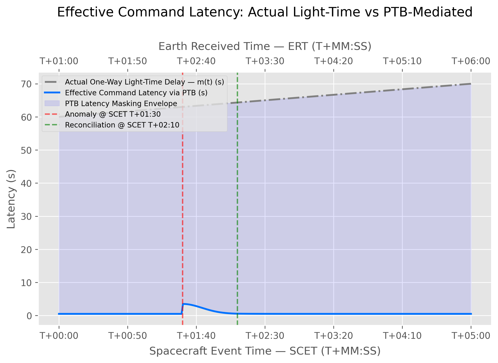

# Predictive Temporal Bridge (PTB) Simulation

Welcome to the **Predictive Temporal Bridge (PTB)** project, a deep-space communications simulation framework. The PTB architecture proposes a solution to the fundamental problem of interplanetary communication: **light-time delay**. 

By utilizing synchronized AI predictive models at both the Earth Command Center and the Mars Spaceship Cabin, the PTB creates a "virtual synchronous" communication interface. This bridges the physical distance by projecting Earth's intent forward in time and allowing the Mars crew to safely reconcile these predictions against their local reality before execution.

## The 4 Human-Computer Interaction (HCI) Metrics

To evaluate the psychological and operational impact of the PTB, the simulation continuously models four vital HCI metrics over the mission timeline. These metrics track how effectively the AI masks the latency and reduces operational friction.

### 1. Social Presence Index (SPI)
Measures the crew's perception of "being there" with ground control. 
- **High SPI:** Signifies a strong feeling of conversational presence and immediacy with the remote partner despite the light-speed delay.
- **Low SPI:** Indicates psychological detachment or interaction friction caused by perceived delays or desynchronization.

### 2. Cognitive Load Index (CLI)
Measures the mental strain on the human operator.
- **High CLI:** Signifies excessive mental stress or confusion, often occurring when the operator must manually reconcile conflicting predictive models or unexpected physical deviations.
- **Low CLI:** Signifies nominal, effortless operation where the AI seamlessly bridges the temporal gap.

### 3. Conversational Latency Illusion (Lat)
Represents the artificial perception of latency experienced by the crew, effectively masked by the PTB.
- **Low Value (< 0.5s):** Signifies the successful "illusion" of real-time communication, hiding the true multiminute light-time delay.
- **High Value (> 1.0s):** Signifies the breakdown of this illusion, usually during sudden unmodeled anomalies where the bridge must temporarily pause to re-synchronize reality.

### 4. Shared Situational Awareness (SA) Sync Rate
Measures the alignment between the Earth Ground Station's AI state representation and the Mars Crew's local reality.
- **High SA Sync:** Signifies that both endpoints share an identical, compatible mental model of the mission state.
- **Low SA Sync:** Signifies active divergence or desynchronization between the two reality models, requiring immediate correction to avoid catastrophic command execution.

## Simulation Analytics

The dashboard calculates these metrics in real-time as anomalies occur. Below is the analytic output demonstrating how the system recovers from a sudden desynchronization event:


*The four primary HCI metrics reacting dynamically to a sudden anomaly and recovering after a successful PTB reconciliation.*



*A closer look at the Conversational Latency Illusion spiking as the AI pauses to resynchronize reality, before restoring the illusion of real-time communication.*

## Understanding the User Interface

The PTB dashboard is specifically designed to visualize the temporal disconnection and psychological state of the operators through a split-screen interface.


*Animated demonstration of the PTB dashboard in action. (Replace with your recorded GIF file)*

### Earth Command Center (Left Panel)
The left panel represents the view from Ground Control. 
- **Telemetry Tab:** Shows the delayed, stale telemetry exactly as it is received from Mars ($t - m$).
- **Trajectory Path Tab:** Visualizes the Earth AI's forward prediction, plotting the ship's projected path to preemptively catch anomalies.
- **Beam-Pack Command Tab:** Displays the formulation of the correction command that is beamed to the ship.

### Mars Spaceship Cabin (Right Panel)
The right panel represents the live environment onboard the spacecraft.
- **Sensors Tab:** Displays the actual, real-time sensor truth ($t$).
- **Reality Overlay Tab:** This is the core of the PTB. It overlays Earth's incoming predictive model over the true local telemetry. This visual convergence—or divergence during an anomaly—directly correlates to the crew's psychological state. When the lines diverge, **Cognitive Load** and **Latency** spike because the crew realizes Earth is out of sync. When they converge, **Social Presence** and **Shared SA** remain high because the crew trusts Earth's situational awareness.
- **Reconciliation & Execute Tab:** Allows the Commander to authorize the Earth command, but *only* if the Reality Overlay proves that Earth's mental model safely matches the ship's physical reality. 

### Social/Psychological HUD (Bottom Panel)
The bottom graph provides a continuous, real-time readout of the 4 HCI metrics. You can directly observe how the crew's psychological state reacts dynamically to the anomaly on the Reality Overlay, and how it recovers once the reconciliation command is executed.

## Running the Simulation

The PTB project includes a fully interactive web dashboard (built with HTML5, CSS3, and a Flask SSE backend) to visualize the predictive models and metrics in real-time. 

To launch the dashboard:

```bash
# Launch the dashboard in live interactive display mode
bash launch.sh display
```

The system will start the local Flask server. Open your web browser and navigate to:
**`http://localhost:5000`**

### Dashboard Features:
- **Interactive UI:** A split-screen design mimicking Earth Command and the Mars Cabin.
- **Live Telemetry:** Dynamic simulation of spacecraft physics, orbital deviations, and thermal loads.
- **Recording:** Click the **"⏺ Start Recording GIF"** button at the top to capture your own animated demonstrations of the dashboard!
